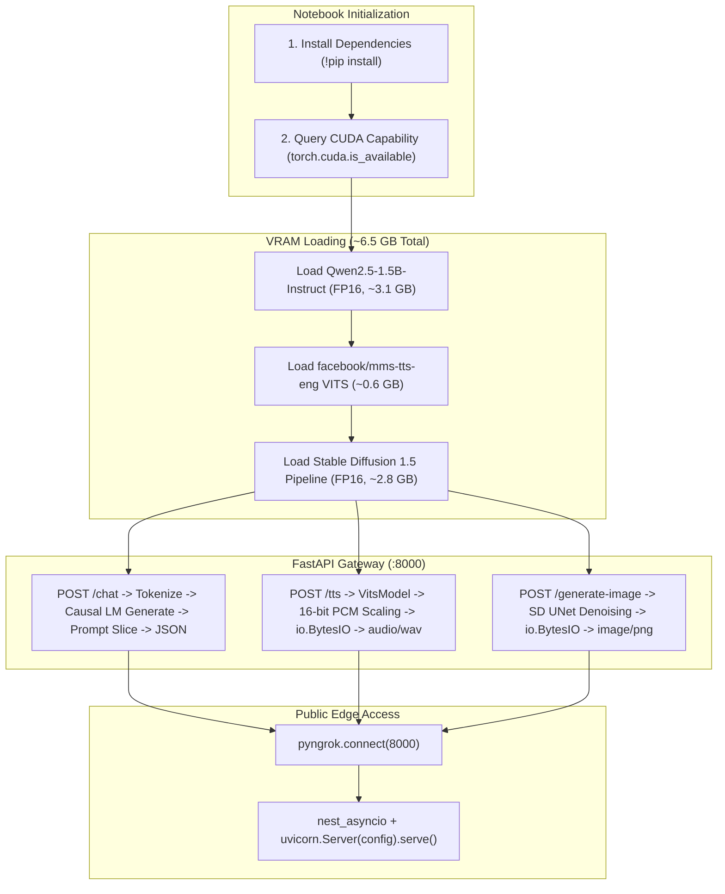

# 📘 Comprehensive Line-by-Line Code Explanation: `colab_multimodal_backend.ipynb`

This document provides a line-by-line technical breakdown and architectural deep dive into [`colab_multimodal_backend.ipynb`](colab_multimodal_backend.ipynb). 

The notebook turns a free Google Colab **NVIDIA T4 GPU (16 GB VRAM)** into a unified multi-capability AI backend hosting **three distinct deep learning models** and exposing them over the public internet via **FastAPI** and **ngrok**.

---

## 📋 Table of Contents
1. [Overview & Execution Lifecycle](#1-overview--execution-lifecycle)
2. [Step 1: Dependency Installation Cell](#2-step-1-dependency-installation-cell)
3. [Step 2: Core Server Code Line-by-Line Breakdown](#3-step-2-core-server-code-line-by-line-breakdown)
   - [Part 2.1: Library Imports & Hardware Acceleration (Lines 67–86)](#part-21-library-imports--hardware-acceleration-lines-6786)
   - [Part 2.2: Tri-Model GPU Co-location & VRAM Allocation (Lines 88–120)](#part-22-tri-model-gpu-co-location--vram-allocation-lines-88120)
   - [Part 2.3: FastAPI App & Pydantic Request Schemas (Lines 122–143)](#part-23-fastapi-app--pydantic-request-schemas-lines-122143)
   - [Part 2.4: Endpoint 1 — Chat Completions & Prompt Slicing (`/chat`) (Lines 145–182)](#part-24-endpoint-1--chat-completions--prompt-slicing-chat-lines-145182)
   - [Part 2.5: Endpoint 2 — VITS Text-to-Speech & PCM Waveform Processing (`/tts`) (Lines 184–204)](#part-25-endpoint-2--vits-text-to-speech--pcm-waveform-processing-tts-lines-184204)
   - [Part 2.6: Endpoint 3 — Stable Diffusion Image Generation (`/generate-image`) (Lines 206–223)](#part-26-endpoint-3--stable-diffusion-image-generation-generate-image-lines-206223)
   - [Part 2.7: ngrok Tunneling & Async Uvicorn Server Launch (Lines 225–243)](#part-27-ngrok-tunneling--async-uvicorn-server-launch-lines-225243)
4. [Key Engineering & Systems Concepts](#4-key-engineering--systems-concepts)

---

## 1. Overview & Execution Lifecycle



---

## 2. Step 1: Dependency Installation Cell

```bash
!pip install diffusers transformers accelerate fastapi uvicorn pyngrok nest-asyncio scipy
```

### Line-by-Line Explanation:
* **`!pip install`**: The exclamation mark (`!`) instructs the Jupyter kernel to execute the command in the underlying Linux bash shell rather than the Python interpreter.
* **`diffusers`**: Hugging Face's state-of-the-art library for diffusion models; provides `StableDiffusionPipeline`, schedulers, and UNet modules.
* **`transformers`**: Hugging Face’s model hub library providing model weights, tokenizers, and architectures for both Qwen (LLM) and Meta MMS (TTS).
* **`accelerate`**: Optimizes PyTorch memory layout and hardware device mapping (`device_map="auto"`).
* **`fastapi`**: Modern, high-performance web framework for building REST APIs with automatic OpenAPI schema validation.
* **`uvicorn`**: Lightning-fast Asynchronous Server Gateway Interface (ASGI) web server implementation used to run FastAPI.
* **`pyngrok`**: Python wrapper for the `ngrok` binary, used to open secure reverse proxy tunnels to Colab localhost ports.
* **`nest-asyncio`**: Patches Python's built-in `asyncio` event loop so that asynchronous servers can run inside an already-active Jupyter notebook event loop.
* **`scipy`**: Scientific computing library; provides `scipy.io.wavfile` to serialize raw audio arrays into standard binary WAV files.

---

## 3. Step 2: Core Server Code Line-by-Line Breakdown

---

### Part 2.1: Library Imports & Hardware Acceleration (Lines 67–86)

```python
67: import io
68: from typing import List, Optional
69: import numpy as np
70: import scipy.io.wavfile as wavfile
71: import torch
72: from diffusers import StableDiffusionPipeline
73: from fastapi import FastAPI, HTTPException
74: from fastapi.responses import Response
75: from pydantic import BaseModel
76: from pyngrok import ngrok
77: import nest_asyncio
78: import uvicorn
79: from transformers import (
80:     AutoModelForCausalLM,
81:     AutoTokenizer,
82:     VitsModel,
83: )
84: 
85: device = "cuda" if torch.cuda.is_available() else "cpu"
86: print(f"[+] Target compute device: {device.upper()}")
```

#### Line-by-Line Breakdown:
* **Line 67 (`import io`)**: Imports Python’s core I/O module. Enables in-memory byte buffers (`io.BytesIO`), allowing audio and image files to be compiled in RAM without touching the Colab hard drive.
* **Line 68 (`from typing import List, Optional`)**: Imports type hinting primitives for Pydantic data schemas.
* **Line 69 (`import numpy as np`)**: Imports NumPy for vector operations on raw audio waveform arrays.
* **Line 70 (`import scipy.io.wavfile as wavfile`)**: Imports the WAV audio encoder to write raw audio arrays into valid `.wav` file containers with proper headers.
* **Line 71 (`import torch`)**: Imports PyTorch, the underlying deep learning tensor and GPU execution framework.
* **Line 72 (`from diffusers import StableDiffusionPipeline`)**: Imports the all-in-one inference pipeline for Stable Diffusion (encapsulates Text Encoder, UNet, Autoencoder VAE, and PNDM/DDIM Schedulers).
* **Line 73 (`from fastapi import FastAPI, HTTPException`)**: Imports the core web application class and the standard exception class for returning HTTP error codes (such as 400 or 500).
* **Line 74 (`from fastapi.responses import Response`)**: Imports raw HTTP response handlers, allowing the endpoints to return arbitrary binary streams (`audio/wav`, `image/png`) instead of only JSON.
* **Line 75 (`from pydantic import BaseModel`)**: Imports Pydantic's data modeling base class, which provides automatic JSON payload parsing and type validation.
* **Line 76 (`from pyngrok import ngrok`)**: Imports the ngrok tunnel manager.
* **Line 77 (`import nest_asyncio`)**: Imports the event-loop patching utility.
* **Line 78 (`import uvicorn`)**: Imports the ASGI web server.
* **Lines 79–83 (`from transformers import ...`)**:
  * `AutoModelForCausalLM`: Instantiates decoder-only language models with next-token prediction heads (used for Qwen 2.5).
  * `AutoTokenizer`: Instantiates tokenizers for text models and the character/phoneme vocabulary for MMS-TTS.
  * `VitsModel`: Instantiates the Variational Inference with adversarial learning for Text-to-Speech (VITS) architecture.
* **Line 85 (`device = "cuda" if torch.cuda.is_available() else "cpu"`)**: Dynamically detects whether an NVIDIA GPU is available; sets `device = "cuda"` for GPU hardware acceleration or falls back to CPU.
* **Line 86 (`print(...)`)**: Outputs the active hardware target to the notebook console.

---

### Part 2.2: Tri-Model GPU Co-location & VRAM Allocation (Lines 88–120)

```python
88: # =============================================================================
89: # 1. MODEL INITIALIZATION
90: # =============================================================================
91: 
92: # --- Model A: Chat LLM (Qwen2.5-1.5B-Instruct) ---
93: print("[1/3] Loading Chat LLM (Qwen/Qwen2.5-1.5B-Instruct)...")
94: llm_id = "Qwen/Qwen2.5-1.5B-Instruct"
95: llm_tokenizer = AutoTokenizer.from_pretrained(llm_id)
96: if llm_tokenizer.pad_token_id is None:
97:     llm_tokenizer.pad_token = llm_tokenizer.eos_token
98:     llm_tokenizer.pad_token_id = llm_tokenizer.eos_token_id
99: llm_model = AutoModelForCausalLM.from_pretrained(
100:     llm_id,
101:     torch_dtype=torch.float16 if torch.cuda.is_available() else torch.float32,
102:     device_map="auto",
103: )
104: print("    ✓ Chat LLM loaded.")
```

#### Line-by-Line Breakdown:
* **Line 94 (`llm_id = "Qwen/Qwen2.5-1.5B-Instruct"`)**: Specifies the Hugging Face repository ID for Alibaba's open-weights 1.5-billion-parameter instruction-tuned model.
* **Line 95 (`llm_tokenizer = ...`)**: Downloads and instantiates the BPE tokenizer containing the vocabulary, merge rules, and ChatML Jinja chat template.
* **Lines 96–98 (`if llm_tokenizer.pad_token_id is None: ...`)**: Configures the tokenizer's padding token. Decoder-only models typically do not have a dedicated `<pad>` token; assigning `pad_token = eos_token` provides a valid padding token ID across all generation calls.
* **Lines 99–103 (`llm_model = ...`)**:
  * `torch_dtype=torch.float16`: Loads the model weights in half-precision (16-bit floating point), halving the required VRAM from ~6.2 GB down to **~3.1 GB**.
  * `device_map="auto"`: Uses `accelerate` to automatically place layers across the GPU Tensor Cores.

```python
103: # --- Model B: Text-to-Speech (facebook/mms-tts-eng) ---
104: print("[2/3] Loading Text-to-Speech Model (facebook/mms-tts-eng)...")
105: tts_id = "facebook/mms-tts-eng"
106: tts_tokenizer = AutoTokenizer.from_pretrained(tts_id)
107: tts_model = VitsModel.from_pretrained(tts_id).to(device)
108: print("    ✓ TTS model loaded.")
```

#### Line-by-Line Breakdown:
* **Line 105 (`tts_id = "facebook/mms-tts-eng"`)**: Specifies Meta's Massively Multilingual Speech model checkpoint fine-tuned on English speech.
* **Line 106 (`tts_tokenizer = ...`)**: Loads the character/phoneme tokenizer that converts input English text into phoneme token IDs.
* **Line 107 (`tts_model = VitsModel.from_pretrained(tts_id).to(device)`)**: Loads the neural vocoder and acoustic model (~140M parameters, occupying **~0.6 GB VRAM**) and moves it to the target device.

```python
110: # --- Model C: Image Generation (Stable Diffusion 1.5) ---
111: print("[3/3] Loading Image Generation Model (runwayml/stable-diffusion-v1-5)...")
112: sd_id = "runwayml/stable-diffusion-v1-5"
113: sd_pipe = StableDiffusionPipeline.from_pretrained(
114:     sd_id,
115:     torch_dtype=torch.float16 if torch.cuda.is_available() else torch.float32,
116: )
117: sd_pipe = sd_pipe.to(device)
118: print("    ✓ Stable Diffusion pipeline loaded.")
119: print("[+] All 3 models ready in VRAM!")
```

#### Line-by-Line Breakdown:
* **Line 112 (`sd_id = "runwayml/stable-diffusion-v1-5"`)**: Identifies the Stable Diffusion 1.5 model checkpoint.
* **Lines 113–116 (`sd_pipe = StableDiffusionPipeline.from_pretrained(...)`)**:
  * Loads the text encoder (CLIP ViT-L/14), diffusion backbone (UNet 860M params), and decoder (AutoencoderKL).
  * `torch_dtype=torch.float16`: Loads the pipeline in FP16 precision, reducing VRAM usage from ~5.5 GB to **~2.8 GB**.
* **Line 117 (`sd_pipe = sd_pipe.to(device)`)**: Transfers all sub-modules of the pipeline onto the GPU.
* **Line 119 (`print(...)`)**: Confirms all 3 models are loaded and co-located in GPU memory (Total: **~6.5 GB VRAM**).

---

### Part 2.3: FastAPI App & Pydantic Request Schemas (Lines 122–143)

```python
124: app = FastAPI(title="Multimodal AI Colab Backend")
125: 
126: class ChatMessage(BaseModel):
127:     role: str
128:     content: str
129: 
130: class ChatRequest(BaseModel):
131:     prompt: Optional[str] = None
132:     messages: Optional[List[ChatMessage]] = None
133:     max_tokens: int = 512
134:     temperature: float = 0.7
135: 
136: class TTSRequest(BaseModel):
137:     text: str
138: 
139: class ImageRequest(BaseModel):
140:     prompt: str
141:     num_inference_steps: int = 30
142:     guidance_scale: float = 7.5
```

#### Line-by-Line Breakdown:
* **Line 124 (`app = FastAPI(...)`)**: Creates the primary ASGI web server instance.
* **Lines 126–128 (`class ChatMessage(BaseModel)`)**: Defines a single chat turn with a `role` (`"system"`, `"user"`, or `"assistant"`) and `content` (string text).
* **Lines 130–134 (`class ChatRequest(BaseModel)`)**:
  * `prompt`: Optional flat string prompt.
  * `messages`: Optional list of structured `ChatMessage` objects (matching the OpenAI Chat Completions API standard).
  * `max_tokens`: Maximum tokens to generate (defaults to `512`).
  * `temperature`: Sampling temperature controlling randomness (defaults to `0.7`).
* **Lines 136–138 (`class TTSRequest(BaseModel)`)**: Schema requiring a single field `text: str` to synthesize into speech.
* **Lines 139–143 (`class ImageRequest(BaseModel)`)**:
  * `prompt`: Text prompt guiding image generation.
  * `num_inference_steps`: Number of denoising iterations (defaults to `30`).
  * `guidance_scale`: Classifier-Free Guidance (CFG) scale (defaults to `7.5`), controlling how strongly the image adheres to the prompt.

---

### Part 2.4: Endpoint 1 — Chat Completions & Prompt Slicing (`/chat`) (Lines 145–182)

```python
145: @app.post("/chat")
146: @app.post("/v1/chat/completions")
147: def chat_endpoint(req: ChatRequest):
148:     try:
149:         if req.messages:
150:             formatted_messages = [{"role": m.role, "content": m.content} for m in req.messages]
151:         elif req.prompt:
152:             formatted_messages = [{"role": "user", "content": req.prompt}]
153:         else:
154:             raise HTTPException(status_code=400, detail="Provide either 'messages' or 'prompt'.")
```

#### Line-by-Line Breakdown:
* **Lines 145–146 (`@app.post("/chat")`, `@app.post("/v1/chat/completions")`)**: Registers dual routes so the endpoint handles both simple custom client calls (`/chat`) and standard OpenAI-compatible requests (`/v1/chat/completions`).
* **Lines 149–154**: Normalizes input into a standard list of dictionaries. If neither `messages` nor `prompt` is provided, raises HTTP 400 Bad Request.

```python
156:         prompt_text = llm_tokenizer.apply_chat_template(
157:             formatted_messages,
158:             tokenize=False,
159:             add_generation_prompt=True,
160:         )
161:         inputs = llm_tokenizer([prompt_text], return_tensors="pt").to(device)
```

#### Line-by-Line Breakdown:
* **Lines 156–160 (`prompt_text = llm_tokenizer.apply_chat_template(...)`)**: Formats the messages using Qwen's ChatML template:
  `<|im_start|>system\n...<|im_end|>\n<|im_start|>user\n...<|im_end|>\n<|im_start|>assistant\n`
  * `tokenize=False`: Returns raw formatted string instead of tensor IDs.
  * `add_generation_prompt=True`: Appends the trailing assistant delimiter (`<|im_start|>assistant\n`) to prompt generation.
* **Line 161 (`inputs = llm_tokenizer(...)`)**: Tokenizes the formatted text into PyTorch tensors (`input_ids` and `attention_mask`) and transfers them to the GPU.

```python
163:         with torch.no_grad():
164:             outputs = llm_model.generate(
165:                 **inputs,
166:                 max_new_tokens=req.max_tokens,
167:                 temperature=req.temperature if req.temperature > 0 else None,
168:                 do_sample=req.temperature > 0,
169:                 pad_token_id=llm_tokenizer.pad_token_id,
170:             )
```

#### Line-by-Line Breakdown:
* **Line 163 (`with torch.no_grad():`)**: Disables autograd gradient calculations, saving memory and accelerating execution.
* **Lines 164–170 (`outputs = llm_model.generate(...)`)**:
  * `**inputs`: Unpacks `input_ids` and `attention_mask`.
  * `max_new_tokens`: Maximum new tokens to generate.
  * `do_sample`: Enabled when `temperature > 0` for stochastic sampling; disabled if `temperature == 0` for greedy search.
  * `pad_token_id`: Explicitly sets pad token to prevent generation errors.

```python
172:         input_len = inputs.input_ids.shape[1]
173:         generated_ids = outputs[0][input_len:]
174:         reply = llm_tokenizer.decode(generated_ids, skip_special_tokens=True).strip()
175: 
176:         return {
177:             "reply": reply,
178:             "choices": [{"message": {"role": "assistant", "content": reply}}],
179:         }
180:     except Exception as e:
181:         raise HTTPException(status_code=500, detail=str(e))
```

#### Line-by-Line Breakdown:
* **Line 172 (`input_len = inputs.input_ids.shape[1]`)**: Measures the token length of the input prompt.
* **Line 173 (`generated_ids = outputs[0][input_len:]`)**: **Prompt Slicing**. Decoder-only models return `[prompt_tokens + output_tokens]`. Slicing off `input_len` ensures only newly generated tokens are retained.
* **Line 174 (`reply = llm_tokenizer.decode(...)`)**: Converts token IDs into a clean Unicode string, stripping special control tokens like `<|im_end|>`.
* **Lines 176–179**: Returns a structured response containing both a simple `"reply"` key and an OpenAI-compatible `"choices"` structure.
* **Lines 180–181**: Catches unexpected runtime errors and wraps them in an HTTP 500 status code.

---

### Part 2.5: Endpoint 2 — VITS Text-to-Speech & PCM Waveform Processing (`/tts`) (Lines 184–204)

```python
184: @app.post("/tts")
185: @app.post("/v1/audio/speech")
186: def tts_endpoint(req: TTSRequest):
187:     try:
188:         inputs = tts_tokenizer(req.text, return_tensors="pt").to(device)
189:         with torch.no_grad():
190:             waveform = tts_model(**inputs).waveform
```

#### Line-by-Line Breakdown:
* **Lines 184–185**: Registers routes for both `/tts` and OpenAI-compatible `/v1/audio/speech`.
* **Line 188 (`inputs = tts_tokenizer(...)`)**: Converts input text into phoneme IDs and moves tensors to GPU.
* **Lines 189–190 (`waveform = tts_model(**inputs).waveform`)**: Executes the VITS forward pass under `torch.no_grad()`. The model directly generates a raw continuous 1D audio waveform tensor normalized between $[-1.0, 1.0]$.

```python
192:         # Extract audio waveform and convert to 16-bit PCM WAV
193:         audio_data = waveform.squeeze().cpu().numpy()
194:         scaled = np.clip(audio_data, -1.0, 1.0)
195:         int16_pcm = (scaled * 32767).astype(np.int16)
196: 
197:         wav_buffer = io.BytesIO()
198:         wavfile.write(wav_buffer, rate=tts_model.config.sampling_rate, data=int16_pcm)
199:         wav_buffer.seek(0)
200: 
201:         return Response(content=wav_buffer.getvalue(), media_type="audio/wav")
202:     except Exception as e:
203:         raise HTTPException(status_code=500, detail=str(e))
```

#### Line-by-Line Breakdown:
* **Line 193 (`audio_data = waveform.squeeze().cpu().numpy()`)**: Removes batch dimensions, transfers the tensor from GPU VRAM to host RAM (`.cpu()`), and converts it to a NumPy array.
* **Line 194 (`scaled = np.clip(audio_data, -1.0, 1.0)`)**: Prevents numerical clipping artifacts by bounding values between $[-1.0, 1.0]$.
* **Line 195 (`int16_pcm = (scaled * 32767).astype(np.int16)`)**: Quantizes float audio into standard **16-bit Signed Linear PCM** format (range: $-32,768$ to $32,767$).
* **Line 197 (`wav_buffer = io.BytesIO()`)**: Creates an in-memory byte buffer in RAM.
* **Line 198 (`wavfile.write(...)`)**: Writes a standard WAV container (with 44-byte RIFF header, channel count, and sampling rate of $16{,}000\text{ Hz}$) into the buffer.
* **Line 199 (`wav_buffer.seek(0)`)**: Resets the buffer’s read pointer to the beginning.
* **Line 201 (`return Response(...)`)**: Streams raw binary WAV bytes back to the HTTP client with MIME type `audio/wav`.

---

### Part 2.6: Endpoint 3 — Stable Diffusion Image Generation (`/generate-image`) (Lines 206–223)

```python
206: @app.post("/generate-image")
207: @app.post("/generate")
208: def image_endpoint(req: ImageRequest):
209:     try:
210:         image = sd_pipe(
211:             req.prompt,
212:             num_inference_steps=req.num_inference_steps,
213:             guidance_scale=req.guidance_scale,
214:         ).images[0]
```

#### Line-by-Line Breakdown:
* **Lines 206–207**: Registers endpoints `/generate-image` and `/generate`.
* **Lines 210–214 (`image = sd_pipe(...)`)**:
  * Embeds the prompt using CLIP text encoder.
  * Generates random Gaussian noise in latent space ($64 \times 64 \times 4$).
  * Iteratively denoises the latents over 30 steps using the UNet guided by `guidance_scale=7.5`.
  * Decodes latents into a $512 \times 512$ RGB pixel image using the VAE decoder.
  * Returns a PIL (`Pillow`) Image object.

```python
216:         img_buffer = io.BytesIO()
217:         image.save(img_buffer, format="PNG")
218:         img_buffer.seek(0)
219: 
220:         return Response(content=img_buffer.getvalue(), media_type="image/png")
221:     except Exception as e:
222:         raise HTTPException(status_code=500, detail=str(e))
```

#### Line-by-Line Breakdown:
* **Line 216 (`img_buffer = io.BytesIO()`)**: Allocates an in-memory RAM buffer.
* **Line 217 (`image.save(img_buffer, format="PNG")`)**: Compresses and serializes the raw PIL image into lossless PNG format.
* **Line 218 (`img_buffer.seek(0)`)**: Rewinds the byte buffer to offset 0.
* **Line 220 (`return Response(...)`)**: Returns binary image bytes with MIME type `image/png`.

---

### Part 2.7: ngrok Tunneling & Async Uvicorn Server Launch (Lines 225–243)

```python
227: # Paste your ngrok authtoken here:
228: NGROK_AUTH_TOKEN = "YOUR_NGROK_AUTH_TOKEN_HERE"
229: ngrok.set_auth_token(NGROK_AUTH_TOKEN)
230: 
231: public_url = ngrok.connect(8000).public_url
232: print("=" * 65)
233: print(f"🚀 Public ngrok Base URL: {public_url}")
234: print(f"   1. Chat Endpoint:       {public_url}/chat")
235: print(f"   2. Text-to-Speech:      {public_url}/tts")
236: print(f"   3. Image Generation:    {public_url}/generate-image")
237: print("=" * 65)
238: 
239: # Apply nest_asyncio to run uvicorn inside Colab notebook event loop
240: config = uvicorn.Config(app, host="0.0.0.0", port=8000)
241: server = uvicorn.Server(config)
242: await server.serve()
```

#### Line-by-Line Breakdown:
* **Line 228 (`NGROK_AUTH_TOKEN = "..."`)**: Placeholder where the user injects their personal ngrok authentication token.
* **Line 229 (`ngrok.set_auth_token(...)`)**: Writes the auth token to `~/.ngrok2/ngrok.yml` on the Colab Linux system.
* **Line 231 (`public_url = ngrok.connect(8000).public_url`)**: Launches the ngrok background daemon and opens a secure public reverse proxy tunnel mapping `https://xxxx.ngrok-free.app` $\rightarrow$ `http://localhost:8000`.
* **Lines 232–237**: Prints the target endpoint URLs to the Colab console.
* **Line 240 (`config = uvicorn.Config(...)`)**: Instantiates the Uvicorn ASGI server configuration listening on all network interfaces (`0.0.0.0`) on port `8000`.
* **Line 241 (`server = uvicorn.Server(config)`)**: Creates the Uvicorn server instance.
* **Line 242 (`await server.serve()`)**: Asynchronously starts the HTTP request listening loop inside the notebook cell. Keeps the Colab runtime active and processing requests.

---

## 4. Key Engineering & Systems Concepts

### 1. GPU Memory Budget (Co-location on 16 GB T4)
| Model | Parameters | Dtype | VRAM Usage |
| :--- | :--- | :--- | :--- |
| **Qwen2.5-1.5B-Instruct** | 1.54B | `float16` | ~3.1 GB |
| **Meta MMS-TTS-Eng** | ~140M | `float32` | ~0.6 GB |
| **Stable Diffusion 1.5** | ~1.0B | `float16` | ~2.8 GB |
| **CUDA Activation Buffer** | — | — | ~0.5 GB |
| **Total Memory Allocated** | — | — | **~7.0 GB / 15.0 GB (Comfortable Safety Margin)** |

### 2. Why Prompt Slicing is Mandatory (`outputs[0][input_len:]`)
Decoder-only models (like GPT and Qwen) concatenate inputs and outputs into a single sequence. Slicing off `input_len` guarantees that the HTTP response contains **only the assistant's newly generated text**, rather than echoing the system instructions and user message back to the client.

### 3. In-Memory Zero-Disk Serialization (`io.BytesIO`)
Rather than saving `temp_audio.wav` and `temp_image.png` to disk before serving, everything is generated directly into volatile RAM. This increases throughput, prevents disk saturation on Colab's virtual filesystem, and eliminates the need for temporary file cleanup routines.
