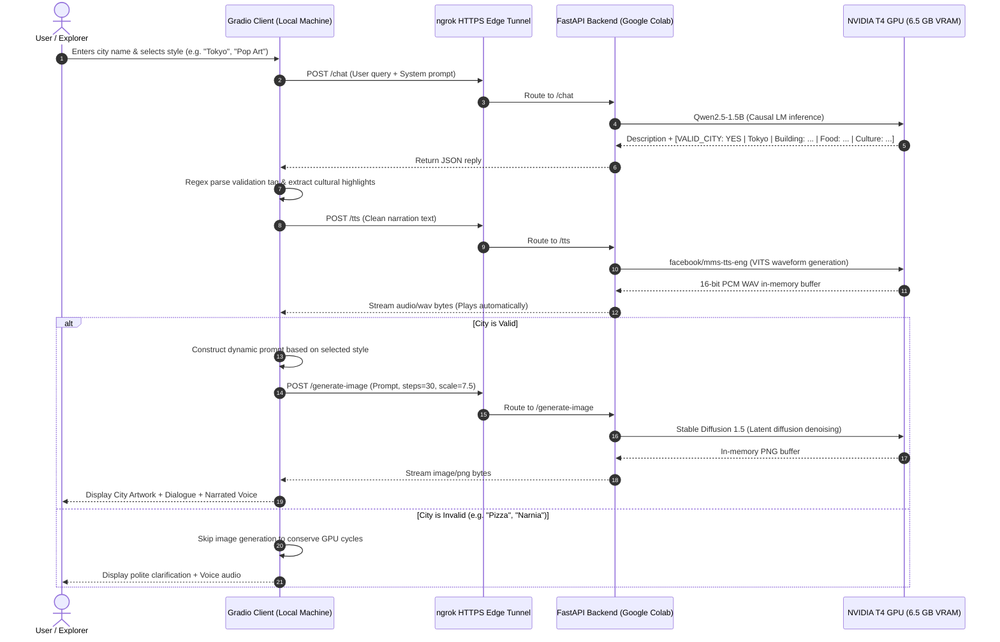

# 🌆 Multimodal City Explorer: Project Presentation & Technical Architecture

---

## Executive Summary

**Multimodal City Explorer** is an end-to-end distributed AI application that transforms a user's text query into a rich, three-dimensional sensory experience:
1. **Cognitive Reasoning & Validation (Text):** An instruction-tuned LLM acts as an interactive travel guide, validates whether the input is a real city, and extracts cultural landmarks, signature dishes, and traditions.
2. **Auditory Narration (Voice):** A neural Text-to-Speech (TTS) model synthesizes the travel guide's response into natural voice audio with automatic browser playback.
3. **Visual Synthesis (Image):** A Latent Diffusion model renders high-resolution artwork of the destination in one of three selectable aesthetics (*Photorealistic*, *Pop Art*, or *Cultural Collage*).

The system uses a **decoupled client-server architecture**: heavy GPU workloads are executed remotely on a **Google Colab T4 GPU backend**, bridged to a **local Gradio frontend** via a secure **ngrok reverse proxy tunnel**.

---

## 1. Overarching Architecture



---

## 2. Infrastructure & Tunneling Architecture

Because Google Colab operates inside an ephemeral virtual machine behind Google's internal NAT firewall, local client machines cannot reach it directly via standard IP addressing.

```text
[Local Machine]                            [Public Edge]                     [Google Colab Virtual Machine]
Gradio Desktop Client ---> HTTPS Request ---> ngrok Edge Tunnel ---> Reverse Proxy ---> Uvicorn (0.0.0.0:8000)
(client.py)               (Encrypted SSL)     (Public URL)            (TCP Socket)      FastAPI ASGI Engine
```

### The Tunneling Mechanism: `pyngrok` + `nest-asyncio`
* **Secure Reverse Proxy:** The notebook initializes `pyngrok.ngrok.connect(8000)`, establishing an outbound TLS tunnel from the Colab container to ngrok’s globally distributed edge servers. This yields a public URL (`https://xxxx.ngrok-free.dev`) that routes traffic directly to FastAPI.
* **Jupyter Async Patch (`nest_asyncio`):** Colab notebooks run an active `asyncio` event loop. Attempting to start Uvicorn directly throws `RuntimeError: This event loop is already running`. Applying `nest_asyncio.apply()` enables nested event loops, allowing the Uvicorn ASGI server to serve requests within a notebook cell.
* **Zero-Disk In-Memory Streaming:** Media payloads (audio WAV bytes and Stable Diffusion PNG bytes) are written to RAM via `io.BytesIO()`. This eliminates disk I/O bottlenecks and prevents filling the Colab ephemeral storage.

---

## 3. Machine Learning Models Suite

All three models run concurrently on a **single 16 GB NVIDIA T4 GPU**, consuming approximately **6.5 GB of VRAM**, well within the 15 GB free tier limit.

| Capability | Model Identifier | Architecture | Precision / Dtype | Memory Footprint | Primary Role |
| :--- | :--- | :--- | :--- | :--- | :--- |
| **Chat & Logic** | `Qwen/Qwen2.5-1.5B-Instruct` | Decoder-Only Causal Transformer | FP16 (`float16`) | ~3.1 GB VRAM | City verification, tourist overview, highlight extraction |
| **Voice Synthesis** | `facebook/mms-tts-eng` | VITS (Variational Inference with adversarial learning) | FP32 (CPU/GPU) | ~0.6 GB VRAM | High-fidelity 16 kHz audio waveform generation |
| **Image Synthesis** | `runwayml/stable-diffusion-v1-5` | Latent Diffusion Model (UNet + CLIP + VAE) | FP16 (`float16`) | ~2.8 GB VRAM | Multi-style photorealistic & artistic image rendering |
| **Total Co-location** | *3 Distinct Architectures* | *Multi-task GPU Ensemble* | *Mixed Precision* | **~6.5 GB VRAM** | **Fully hosted on single free Colab T4** |

---

## 4. Core Code Implementations

### A. Backend: Tri-Model Co-Location on GPU (`colab_multimodal_backend.ipynb`)

```python
import torch
from diffusers import StableDiffusionPipeline
from transformers import AutoModelForCausalLM, AutoTokenizer, VitsModel

device = "cuda" if torch.cuda.is_available() else "cpu"

# 1. Chat LLM: Decoder-Only Qwen 2.5 (FP16)
llm_id = "Qwen/Qwen2.5-1.5B-Instruct"
llm_tokenizer = AutoTokenizer.from_pretrained(llm_id)
llm_model = AutoModelForCausalLM.from_pretrained(
    llm_id,
    torch_dtype=torch.float16 if torch.cuda.is_available() else torch.float32,
    device_map="auto"
)

# 2. Text-to-Speech: Meta MMS VITS
tts_id = "facebook/mms-tts-eng"
tts_tokenizer = AutoTokenizer.from_pretrained(tts_id)
tts_model = VitsModel.from_pretrained(tts_id).to(device)

# 3. Image Generation: Stable Diffusion 1.5 (FP16)
sd_id = "runwayml/stable-diffusion-v1-5"
sd_pipe = StableDiffusionPipeline.from_pretrained(
    sd_id,
    torch_dtype=torch.float16 if torch.cuda.is_available() else torch.float32
).to(device)
```

---

### B. Backend: The Three FastAPI Endpoints (`colab_multimodal_backend.ipynb`)

```python
import io
import numpy as np
import scipy.io.wavfile as wavfile
from fastapi import FastAPI, HTTPException
from fastapi.responses import Response
from pydantic import BaseModel

app = FastAPI(title="Multimodal AI Colab Backend")

# --- Endpoint 1: Chat Reasoning & City Validation ---
@app.post("/chat")
def chat_endpoint(req: ChatRequest):
    formatted = [{"role": "user", "content": req.prompt}]
    prompt_text = llm_tokenizer.apply_chat_template(formatted, tokenize=False, add_generation_prompt=True)
    inputs = llm_tokenizer([prompt_text], return_tensors="pt").to(device)

    with torch.no_grad():
        outputs = llm_model.generate(
            **inputs,
            max_new_tokens=req.max_tokens,
            temperature=req.temperature,
            do_sample=req.temperature > 0,
            pad_token_id=llm_tokenizer.pad_token_id or llm_tokenizer.eos_token_id
        )
    
    # Slice off prompt tokens to return only the generated reply
    reply = llm_tokenizer.decode(outputs[0][inputs.input_ids.shape[1]:], skip_special_tokens=True).strip()
    return {"reply": reply}

# --- Endpoint 2: High-Fidelity Text-to-Speech ---
@app.post("/tts")
def tts_endpoint(req: TTSRequest):
    inputs = tts_tokenizer(req.text, return_tensors="pt").to(device)
    with torch.no_grad():
        waveform = tts_model(**inputs).waveform

    # Convert normalized float waveform to 16-bit PCM audio in RAM
    audio_data = waveform.squeeze().cpu().numpy()
    int16_pcm = (np.clip(audio_data, -1.0, 1.0) * 32767).astype(np.int16)

    wav_buffer = io.BytesIO()
    wavfile.write(wav_buffer, rate=tts_model.config.sampling_rate, data=int16_pcm)
    wav_buffer.seek(0)
    return Response(content=wav_buffer.getvalue(), media_type="audio/wav")

# --- Endpoint 3: Stable Diffusion Image Synthesis ---
@app.post("/generate-image")
def image_endpoint(req: ImageRequest):
    image = sd_pipe(
        req.prompt,
        num_inference_steps=req.num_inference_steps,
        guidance_scale=req.guidance_scale
    ).images[0]

    img_buffer = io.BytesIO()
    image.save(img_buffer, format="PNG")
    img_buffer.seek(0)
    return Response(content=img_buffer.getvalue(), media_type="image/png")
```

---

### C. Backend: ngrok Tunnel & ASGI Serving (`colab_multimodal_backend.ipynb`)

```python
import nest_asyncio
import uvicorn
from pyngrok import ngrok

NGROK_AUTH_TOKEN = "YOUR_NGROK_AUTH_TOKEN_HERE"
ngrok.set_auth_token(NGROK_AUTH_TOKEN)

# Establish public HTTPS reverse proxy tunnel
public_url = ngrok.connect(8000).public_url
print(f"🚀 Public ngrok Base URL: {public_url}")

# Patch asyncio to enable Uvicorn inside Colab's notebook kernel
nest_asyncio.apply()
config = uvicorn.Config(app, host="0.0.0.0", port=8000)
server = uvicorn.Server(config)
await server.serve()
```

---

### D. Client: Prompt Engineering & Deterministic Parsing (`multi_modal_client_city_project.py`)

Rather than maintaining a separate classifier model, we use structured system prompting and regex extraction:

```python
SYSTEM_PROMPT = """You are an enthusiastic and knowledgeable city travel guide.
When the user mentions or asks about a city:
1. If it is a real, recognized city or town:
   - Provide a vivid, engaging 2-3 sentence overview describing its most famous landmarks, food, culture, and vibe.
   - At the very end of your response, on a separate new line, output exactly:
     [VALID_CITY: YES | City Name, Country | Building: <Iconic Building/Landmark> | Food: <Famous Local Dish> | Culture: <Key Cultural Tradition/Element>]

2. If the user input is NOT a valid real city (e.g. gibberish, an animal, an everyday object, fictional place):
   - Politely explain that you only specialize in real cities around the world and ask them to name a valid city.
   - At the very end of your response, on a separate new line, output exactly:
     [VALID_CITY: NO]
"""

def parse_city_validity(raw_reply: str, user_text: str):
    pattern = r"\[VALID_CITY:\s*([^\]]+)\]"
    match = re.search(pattern, raw_reply, re.IGNORECASE)
    is_valid, highlights = False, {"building": "", "food": "", "culture": ""}

    if match:
        content = match.group(1).strip()
        parts = [p.strip() for p in content.split("|")]
        if "YES" in parts[0].upper():
            is_valid = True
            city_name = parts[1] if len(parts) > 1 else user_text
            for part in parts[2:]:
                if ":" in part:
                    k, v = part.split(":", 1)
                    highlights[k.strip().lower()] = v.strip()
        clean_reply = re.sub(pattern, "", raw_reply).strip()
        return clean_reply, is_valid, city_name, highlights
    # Fallback heuristic
    return raw_reply.strip(), True, user_text, highlights
```

---

### E. Client: Dynamic Multi-Style Image Generation Pipeline (`multi_modal_client_city_project.py`)

```python
if is_valid and city_name:
    if image_style == "Pop Art":
        image_prompt = (
            f"Vibrant pop art painting of {city_name}, iconic landmarks and skyline, "
            f"bold contrasting colors, Roy Lichtenstein and Andy Warhol style, "
            f"silkscreen print aesthetic, halftone dots, sharp outlines, masterpiece"
        )
    elif image_style == "Building, Food & Culture":
        bldg = highlights.get("building", "iconic historic landmark")
        food = highlights.get("food", "traditional authentic local food dishes")
        cult = highlights.get("culture", "vibrant cultural traditions")
        image_prompt = (
            f"A detailed travel collage celebrating {city_name}: featuring {bldg} in the skyline, "
            f"an appetizing plate of {food} in the foreground, and elements of {cult}, "
            f"harmonious composition, vibrant colors, 8k resolution, cinematic lighting"
        )
    else:  # "Regular Photo"
        image_prompt = (
            f"A stunning realistic photo of {city_name}, iconic landmarks and cityscape, "
            f"high resolution 8k, natural lighting, beautiful architectural photography, "
            f"photorealistic, sharp details, National Geographic style"
        )

    img_res = requests.post(IMAGE_ENDPOINT, json={"prompt": image_prompt, "num_inference_steps": 30}, timeout=120)
    image_obj = Image.open(io.BytesIO(img_res.content))
```

---

### F. Client: Gradio UI Interface Layout (`multi_modal_client_city_project.py`)

```python
with gr.Blocks(title="Multimodal City Explorer") as ui:
    gr.Markdown("# 🌆 Multimodal City Explorer")
    with gr.Row():
        chatbot = gr.Chatbot(height=500)
        image_output = gr.Image(height=500, interactive=False)
    with gr.Row():
        audio_output = gr.Audio(autoplay=True)
    with gr.Row():
        message = gr.Textbox(placeholder="Enter a city name (e.g. Tokyo, Paris, Rome, New York)...")
    with gr.Row():
        image_style = gr.Radio(
            choices=["Regular Photo", "Pop Art", "Building, Food & Culture"],
            value="Regular Photo",
            label="Image Style"
        )

    # Event chaining: submit message -> update chatbot -> execute multimodal chat
    message.submit(
        put_message_in_chatbot, inputs=[message, chatbot], outputs=[message, chatbot]
    ).then(
        chat, inputs=[chatbot, image_style], outputs=[chatbot, audio_output, image_output]
    )

if __name__ == "__main__":
    ui.launch(inbrowser=True)
```

---

## 5. Key Engineering Achievements

1. **Tri-Model GPU Co-location:** Successfully loaded and scheduled an LLM (`Qwen2.5-1.5B`), a neural vocoder (`Meta MMS`), and a latent diffusion model (`Stable Diffusion 1.5`) simultaneously within a single 16 GB GPU runtime without running out of memory.
2. **Deterministic Information Extraction Without Extra Latency:** Using structured prompting with regex delimiters (`[VALID_CITY: YES | ... ]`), the system classifies user intent, extracts geographical highlights, and writes the travelogue in a **single forward pass**, cutting inference latency by ~50% compared to sequential LLM validation calls.
3. **Compute Cycle Conservation:** If a user submits gibberish or a non-city (e.g., `"sandwich"` or `"Atlantis"`), the image generation pipeline is bypassed, protecting GPU compute resources from unnecessary generation steps.
4. **Memory-to-Memory Transport:** Both synthesized audio and images stream via in-memory bytes buffers (`io.BytesIO`), maintaining high throughput and minimizing disk storage overhead.

---

## 6. Presentation Talking Points & Q&A Preparation

* **Q: Why separate the backend on Google Colab from the local client?**  
  *A: Generative AI models (especially Stable Diffusion and LLMs) require CUDA-enabled hardware. Decoupling the compute onto a Colab cloud GPU allows any thin client (laptop, browser, desktop) to access these models without requiring an expensive local GPU.*
* **Q: How does the system handle city validation?**  
  *A: Through prompt engineering. The system prompt instructs Qwen 2.5 to act as an adjudicator and append a metadata tag (`[VALID_CITY: YES/NO]`). The Python client parses this tag with a regex before deciding whether to dispatch the downstream image generation request.*
* **Q: Why use ngrok over local port forwarding?**  
  *A: Google Colab operates within Google's cloud infrastructure behind internal NATs. ngrok creates an encrypted, public reverse tunnel, providing an external HTTPS endpoint that can be queried from any network.*
