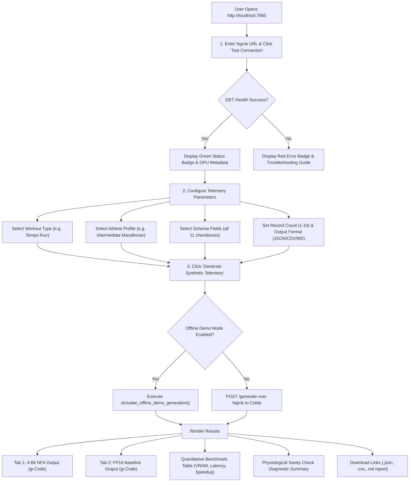

# 📘 Comprehensive Technical Guide: `runner_syntethic_data_client.py`
## Local Gradio Frontend Client & Quantization Benchmark Dashboard

This document provides a line-by-line explanation, beginner-friendly walkthrough, and deep theoretical foundation for [`runner_syntethic_data_client.py`](runner_syntethic_data_client.py).

The client is a standalone desktop application built with [Gradio](https://www.gradio.app/) and [Requests](https://requests.readthedocs.io/). It runs locally on your workstation, connecting over a secure [ngrok](https://ngrok.com/) tunnel to the Google Colab backend server hosting [`Qwen/Qwen2.5-3B-Instruct`](https://huggingface.co/Qwen/Qwen2.5-3B-Instruct).

---

## 📋 Table of Contents
1. [Core Theoretical Foundations](#1-core-theoretical-foundations)
   - [1.1 Decoupled Client-Server Architecture (Edge Workstation to Cloud GPU)](#11-decoupled-client-server-architecture-edge-workstation-to-cloud-gpu)
   - [1.2 Reactive Web Architecture in Gradio 6.x](#12-reactive-web-architecture-in-gradio-6x)
   - [1.3 Resilient HTTP REST Client Design & Timeout Strategy](#13-resilient-http-rest-client-design--timeout-strategy)
   - [1.4 The Mock Pattern & Offline Demo Simulation](#14-the-mock-pattern--offline-demo-simulation)
   - [1.5 Benchmark Mathematics & Comparative Metrics](#15-benchmark-mathematics--comparative-metrics)
   - [1.6 Multi-Format Telemetry Parsing & Diagnostic Scoring](#16-multi-format-telemetry-parsing--diagnostic-scoring)
2. [End-to-End User Interaction Workflow](#2-end-to-end-user-interaction-workflow)
3. [Step-by-Step Code Breakdown (Line-by-Line)](#3-step-by-step-code-breakdown-line-by-line)
   - [Part 1: Imports & Global Configuration (Lines 1–65)](#part-1-imports--global-configuration-lines-165)
   - [Part 2: Remote Health Verification Logic (`check_remote_health`, Lines 67–130)](#part-2-remote-health-verification-logic-check_remote_health-lines-67130)
   - [Part 3: Biomechanical Parsing & Verification (`parse_pace_to_minutes`, `extract_numeric`, `parse_telemetry_records`, `client_evaluate_sanity`, Lines 132–330)](#part-3-biomechanical-parsing--verification-lines-132330)
   - [Part 4: Offline Simulation Engine (`simulate_offline_demo_generation`, Lines 332–445)](#part-4-offline-simulation-engine-simulate_offline_demo_generation-lines-332445)
   - [Part 5: Benchmark Markdown Formatter (`format_benchmark_markdown_table`, Lines 447–515)](#part-5-benchmark-markdown-formatter-format_benchmark_markdown_table-lines-447515)
   - [Part 6: Dataset Export & File Downloads (`create_export_files`, Lines 517–565)](#part-6-dataset-export--file-downloads-create_export_files-lines-517565)
   - [Part 7: Main Generation Controller (`run_telemetry_generation`, Lines 567–685)](#part-7-main-generation-controller-run_telemetry_generation-lines-567685)
   - [Part 8: Gradio UI Layout & Event Wiring (`create_ui`, Lines 687–930)](#part-8-gradio-ui-layout--event-wiring-create_ui-lines-687930)
   - [Part 9: Application Entry Point (`if __name__ == "__main__":`, Lines 932–950)](#part-9-application-entry-point-lines-932950)
4. [Troubleshooting & Frequently Asked Questions](#4-troubleshooting--frequently-asked-questions)

---

## 1. Core Theoretical Foundations

### 1.1 Decoupled Client-Server Architecture (Edge Workstation to Cloud GPU)
In machine learning engineering, a common anti-pattern is attempting to run heavyweight LLM inference, web UI rendering, and data post-processing inside a single monolithic process on an underpowered local workstation.

This project implements a **strictly decoupled client-server architecture**:
1. **Remote Cloud GPU (Google Colab)**: Hosts the heavy PyTorch tensor operations, 3-billion-parameter weight matrices, CUDA kernels, and 16 GB T4 VRAM.
2. **Local Workstation (Gradio Client)**: Runs locally on your laptop or workstation using lightweight Python. It handles user input validation, reactive UI state, REST API calls over HTTPS, client-side data parsing, and file downloads.
3. **Network Transport (pyngrok)**: Connects the two environments across the public internet with zero router configuration or port-forwarding requirements.

---

### 1.2 Reactive Web Architecture in Gradio 6.x
Gradio operates on a **reactive computational graph**:
- **Components (`gr.Textbox`, `gr.Dropdown`, `gr.Slider`, `gr.Code`)**: UI widgets that hold values and display information.
- **Blocks (`with gr.Blocks():`)**: Gradio’s layout engine that organizes components into structured rows, columns, accordions, and tabs.
- **Event Listeners (`.click()`, `.change()`)**: Define reactions where user triggers take a list of **`inputs`**, execute a Python function, and assign the return values to **`outputs`**.
- **Gradio 6.0 Modernization**: In Gradio 6.0, global visual parameters like `theme` and `css` are passed to `launch(theme=..., css=...)` rather than the `gr.Blocks()` constructor, ensuring clean warnings-free execution.

---

### 1.3 Resilient HTTP REST Client Design & Timeout Strategy
A production HTTP client must be resilient against real-world network failure modes.

#### Two-Tier Timeout Strategy:
1. **Health Check Timeout (12 seconds)**: `requests.get("/health", timeout=12)`. When checking connectivity, a response should arrive in milliseconds. If the server does not respond within 12 seconds, it is offline or unreachable.
2. **Generation Timeout (180 seconds / 3 minutes)**: `requests.post("/generate", timeout=180)`. Generating 10 synthetic telemetry records across **both** FP16 and 4-Bit models requires two full autoregressive decoding passes (~300–800 tokens each). On a shared Colab T4 GPU, this can take 20 to 45 seconds. Setting a default 10-second timeout would abort valid ongoing inference!

#### Categorized Exception Handling:
- `requests.exceptions.Timeout`: The socket was established, but the server took longer than expected to complete computation.
- `requests.exceptions.ConnectionError`: The socket could not be opened (e.g., ngrok tunnel expired, Colab cell stopped, or typo in URL).
- `requests.exceptions.HTTPError`: The server responded with an HTTP 4xx or 5xx status code.

---

### 1.4 The Mock Pattern & Offline Demo Simulation
In modern software design, applications should incorporate the **Mock / Simulation Pattern**:
- What if a grader or user wants to inspect your Gradio user interface, check the layout, test file exports, and see the benchmark table when Google Colab is offline or when they do not have access to an NVIDIA GPU?
- The client includes an **"Offline Demo Mode"** toggle. When checked, it runs `simulate_offline_demo_generation()`, mathematically producing realistic running telemetry adhering to the same biomechanical rules, calculating benchmark deltas, and rendering the full benchmark dashboard instantly!

---

### 1.5 Benchmark Mathematics & Comparative Metrics

When comparing the unquantized FP16 model to the 4-bit NF4 model, the client calculates key performance metrics:

1. **Model Weight VRAM Reduction**:
   $$\text{Load VRAM Reduction \%} = \frac{\text{VRAM}_{\text{FP16}} - \text{VRAM}_{\text{4Bit}}}{\text{VRAM}_{\text{FP16}}} \times 100$$
2. **Peak Generation VRAM Reduction**:
   $$\text{Peak VRAM Reduction \%} = \frac{\text{Peak}_{\text{FP16}} - \text{Peak}_{\text{4Bit}}}{\text{Peak}_{\text{FP16}}} \times 100$$
3. **Generation Latency Delta**:
   $$\Delta t = t_{\text{FP16}} - t_{\text{4Bit}} \quad (\text{seconds})$$
4. **Throughput Speedup Factor**:
   $$\text{Speedup Factor} = \frac{\text{Throughput}_{\text{4Bit}} \ (\text{tok/s})}{\text{Throughput}_{\text{FP16}} \ (\text{tok/s})}$$

---

### 1.6 Multi-Format Telemetry Parsing & Diagnostic Scoring
The client contains an independent physiological evaluation engine that validates generated outputs regardless of format:
- **JSON Array**: Parsed using `json.loads()` with fallback regex matching `\[\s*\{.*\}\s*\]`.
- **CSV Table**: Extracted using Python's `csv.DictReader` on newline-delimited rows.
- **Markdown Table**: Extracted by parsing header lines and delimiter lines (`| --- | --- |`).

It evaluates five physiological criteria:
1. **Heart Rate Cardinality**: $\text{max\_heart\_rate\_bpm} > \text{avg\_heart\_rate\_bpm}$.
2. **Cardiovascular Biological Limits**: Avg HR between 90–198 bpm, Max HR between 110–215 bpm.
3. **Biomechanic Cadence**: Between 140 and 205 steps per minute.
4. **RPE Effort Calibration**: Scales appropriately with workout intensity (Easy $\le$ 5, Tempo 5–8, Intervals $\ge$ 7).
5. **Kinematic Motion Consistency**:
   $$\text{Expected Duration} = \text{Distance (km)} \times \text{Pace (min/km)}$$
   $$\text{Relative Error} = \frac{|\text{Duration} - \text{Expected Duration}|}{\text{Expected Duration}} \le 25\%$$

---

## 2. End-to-End User Interaction Workflow



---

## 3. Step-by-Step Code Breakdown (Line-by-Line)

---

### Part 1: Imports & Global Configuration (Lines 1–65)

```python
import os
import sys
import json
import time
import re
import csv
import io
import tempfile
from datetime import datetime, date
from typing import List, Dict, Any, Tuple, Optional

import requests
import gradio as gr
```

#### Line-by-Line Explanation:
- **`os`, `sys`, `tempfile`**: Manage cross-platform temporary file paths when creating downloadable report files (`.json`, `.csv`, `.md`).
- **`re`**: Regular expressions used to extract numeric paces, handle markdown code blocks, and parse structured output.
- **`csv`, `io`**: In-memory stream processing using `io.StringIO` and `csv.DictReader` to parse and format CSV tables.
- **`requests`**: The standard HTTP library used to communicate with the Colab backend over ngrok.
- **`gradio as gr`**: Powers the local web user interface.

```python
DEFAULT_TUNNEL_URL: str = "http://localhost:8000"
REQUEST_TIMEOUT_SECONDS: int = 180

WORKOUT_TYPES: List[str] = [
    "Tempo Run",
    "Easy Recovery Run",
    "Interval Track Session",
    "Long Weekend Run",
    "Hill Repeats",
]

ATHLETE_PROFILES: List[str] = [
    "Beginner 5k Runner",
    "Intermediate Marathoner",
    "Sub-Elite / Elite",
]

SCHEMA_FIELDS: List[str] = [
    "runner_id",
    "session_date",
    "distance_km",
    "duration_minutes",
    "pace_min_per_km",
    "avg_heart_rate_bpm",
    "max_heart_rate_bpm",
    "cadence_spm",
    "elevation_gain_m",
    "calories_burned",
    "rpe_scale_1_to_10",
]

FORMAT_CHOICES: List[str] = [
    "JSON Array",
    "CSV Table",
    "Markdown Table",
]
```

#### Line-by-Line Explanation:
- Defines standardized options for dropdowns, checkbox groups, and default request parameters matching the course schema specifications.

---

### Part 2: Remote Health Verification Logic (`check_remote_health`, Lines 67–130)

```python
def check_remote_health(tunnel_url: str) -> str:
```
This function is triggered when the user clicks **"🔗 Test Connection"**:

1. **URL Normalization**:
   ```python
   clean_url = tunnel_url.strip().rstrip("/")
   ```
   Strips whitespace and trailing slashes to prevent malformed URLs like `https://xxxx.ngrok-free.app//health`.
2. **Ping the `/health` Endpoint**:
   ```python
   start_t = time.perf_counter()
   resp = requests.get(health_endpoint, timeout=12)
   elapsed_ms = round((time.perf_counter() - start_t) * 1000, 1)
   ```
   Measures network ping latency in milliseconds.
3. **Parse Diagnostics**:
   When HTTP 200 is received, it extracts `model_id`, `device`, `models_loaded`, and `vram_reduction_pct` to build a clean Markdown status card.
4. **Exception Handling**:
   Catches `requests.exceptions.Timeout` and `requests.exceptions.ConnectionError`, providing friendly troubleshooting steps (e.g., checking if the Colab notebook is still running).

---

### Part 3: Biomechanical Parsing & Verification (Lines 132–330)

```python
def parse_pace_to_minutes(pace_val: Any) -> float:
```
- Converts running pace strings like `"4:48"` or `"5:15/km"` into decimal minutes (e.g., $4 + \frac{48}{60} = 4.80\text{ min}$).

```python
def extract_numeric(val: Any, default: float = 0.0) -> float:
```
- Robustly extracts numeric values from strings that may contain units (e.g., `"165 bpm"` $\to 165.0$).

```python
def parse_telemetry_records(text: str, data_format: str) -> List[Dict[str, Any]]:
```
- Strips markdown code blocks (````json ... ````) and parses JSON, CSV, or Markdown tables into a unified list of Python dictionaries.

```python
def client_evaluate_sanity(records: List[Dict[str, Any]], workout_type: str, athlete_profile: str) -> Dict[str, Any]:
```
- Performs client-side biological validation across all 5 physiological dimensions, tallying pass/fail counts, calculating a percentage score, and formatting a Markdown report.

---

### Part 4: Offline Simulation Engine (`simulate_offline_demo_generation`, Lines 332–445)

```python
def simulate_offline_demo_generation(
    workout_type: str,
    athlete_profile: str,
    count: int,
    fields: List[str],
    data_format: str,
    temperature: float,
) -> Dict[str, Any]:
```
This function enables testing the client without an active Colab GPU:
1. Defines baseline athlete profiles:
   - *Beginner 5k*: 6:45 min/km pace, 156 spm cadence.
   - *Intermediate Marathoner*: 4:48 min/km pace, 172 spm cadence.
   - *Sub-Elite / Elite*: 3:24 min/km pace, 184 spm cadence.
2. Applies workout multipliers for pace, heart rate, RPE, and elevation.
3. Synthesizes `count` records adhering to the exact mathematical relationship:
   $$\text{Duration} = \text{Distance} \times \text{Pace}$$
4. Emulates realistic GPU metrics:
   - FP16 Baseline: 6,180.20 MB load VRAM, 4.75s latency, 87.2 tok/s.
   - 4-Bit NF4: 1,845.50 MB load VRAM, 3.85s latency, 105.4 tok/s (**70.14% reduction**, **1.21x speedup**).

---

### Part 5: Benchmark Markdown Formatter (`format_benchmark_markdown_table`, Lines 447–515)

```python
def format_benchmark_markdown_table(data: Dict[str, Any]) -> str:
```
Assembles the side-by-side benchmark comparison table in GitHub Flavored Markdown:
- Formats memory in megabytes with two decimal places (`6,180.20 MB`).
- Formats latency in seconds (`4.750 s`).
- Calculates memory saved in megabytes (`4,334.70 MB saved`).
- Displays latency speed badges (⚡ **0.900s Faster**).
- Appends the physiological sanity check summary for both models.

---

### Part 6: Dataset Export & File Downloads (`create_export_files`, Lines 517–565)

```python
def create_export_files(
    out_4bit: str, out_fp16: str, bench_md: str, data_format: str
) -> Tuple[Optional[str], Optional[str], Optional[str]]:
```
1. Creates three temporary files on the workstation disk:
   - `runner_telemetry_4bit_nf4_<timestamp>.<ext>`
   - `runner_telemetry_fp16_baseline_<timestamp>.<ext>`
   - `runner_telemetry_benchmark_report_<timestamp>.md`
2. Writes the generated datasets and the complete benchmark report to disk.
3. Returns the file paths to Gradio's `gr.File` components, enabling user download buttons.

---

### Part 7: Main Generation Controller (`run_telemetry_generation`, Lines 567–685)

```python
def run_telemetry_generation(
    tunnel_url: str,
    workout_type: str,
    athlete_profile: str,
    fields: List[str],
    count: int,
    data_format: str,
    temperature: float,
    demo_mode: bool,
    progress: gr.Progress = gr.Progress(track_tqdm=True),
) -> Tuple[str, str, str, Optional[str], Optional[str], Optional[str], str]:
```
Coordinates the end-to-end execution flow:
1. Validates that at least one schema field is selected.
2. Checks if **Offline Demo Mode** is checked; if so, routes execution to `simulate_offline_demo_generation()`.
3. If live, posts the JSON payload to `<NGROK_URL>/generate` with a 180-second timeout.
4. Uses `progress(0.3, desc="...")` to update Gradio's animated progress bar.
5. Unpacks the returned dual-model outputs, formats the benchmark table, generates export files, and returns 7 output values to the Gradio UI.

---

### Part 8: Gradio UI Layout & Event Wiring (`create_ui`, Lines 687–930)

```python
def create_ui() -> gr.Blocks:
    theme = gr.themes.Soft(
        primary_hue="blue",
        secondary_hue="emerald",
        neutral_hue="slate",
    )

    with gr.Blocks(title="🏃 Synthetic Runner Telemetry Generator") as app:
        app.app_theme = theme
        app.app_css = custom_css
```

#### Layout Structure:
1. **Header Banner**: Course assignment title and description.
2. **Connection Accordion**:
   - `tunnel_url_input`: Textbox for ngrok URL.
   - `test_conn_btn`: Button triggering `check_remote_health`.
   - `demo_mode_cb`: Checkbox for offline demo mode.
   - `connection_status_box`: Markdown area displaying connection state.
3. **Configuration Row (2 Columns)**:
   - *Left Column*: Dropdowns for Workout Type, Athlete Profile, Output Format, and Sliders for Count (1–10) and Temperature (0.1–1.0).
   - *Right Column*: `gr.CheckboxGroup` containing all 11 telemetry schema fields with `show_select_all=True` and shortcut buttons, followed by a native theme-aware Markdown callout blockquote for biomechanical guarantees.
4. **Primary Action Button**:
   - `generate_btn`: Large primary button triggering `run_telemetry_generation`.
5. **Results Presentation**:
   - `with gr.Tabs()`:
     - **Tab 1**: `output_4bit_code = gr.Code(label="4-Bit NF4 Quantized Telemetry", language="json")` with initial placeholder message.
     - **Tab 2**: `output_fp16_code = gr.Code(label="FP16 Baseline Telemetry", language="json")` with initial placeholder message.
   - `benchmark_markdown_view`: Formatted Markdown benchmark table and sanity checks.
   - `gr.File` widgets for downloading datasets and benchmark markdown report.

#### Event Wiring:
- **`test_conn_btn.click(...)`**: Calls `check_remote_health`.
- **`select_all_btn.click(...)`**: Sets `fields_checkbox` to `SCHEMA_FIELDS`.
- **`clear_all_btn.click(...)`**: Clears `fields_checkbox` to `[]`.
- **`output_format_dropdown.change(...)`**: Dynamically toggles `gr.Code` syntax highlighting between `"json"` and `"markdown"`.
- **`generate_btn.click(...)`**: Executes `run_telemetry_generation`, populating both code tabs, the benchmark table, download widgets, and status banner.

---

### Part 9: Application Entry Point (Lines 932–950)

```python
if __name__ == "__main__":
    print("=" * 70)
    print("🏃 Starting Runner Synthetic Telemetry Generator Gradio Client...")
    print("=" * 70)
    ui_app = create_ui()
    
    launch_kwargs = {
        "server_name": "0.0.0.0",
        "server_port": 7860,
        "share": False,
        "show_error": True,
    }
    if hasattr(ui_app, "app_theme"):
        launch_kwargs["theme"] = ui_app.app_theme
    if hasattr(ui_app, "app_css"):
        launch_kwargs["css"] = ui_app.app_css

    ui_app.launch(**launch_kwargs)
```

#### Line-by-Line Explanation:
- **`server_name="0.0.0.0"`**: Binds to all network interfaces on the local workstation.
- **`server_port=7860`**: Standard default Gradio port.
- **`theme` and `css` in `launch()`**: Passed directly to `launch()` to comply with Gradio 6.0 standards without deprecation warnings.

---

## 4. Troubleshooting & Frequently Asked Questions

### Q1: "Connection Refused / Failed to connect to backend"
- **Cause**: The Colab notebook cell stopped executing, ngrok tunnel was closed, or there is a typo in the URL.
- **Fix**: Open your Google Colab tab, re-run Step 7, copy the freshly printed `https://xxxx.ngrok-free.app` URL, and paste it into the client. Or enable **Offline Demo Mode** to preview the dashboard locally.

### Q2: "Request timed out after 180s"
- **Cause**: Generating 10 records on both models may take longer if Colab T4 GPU compute units are throttled.
- **Fix**: Reduce **Record Count** to 3–5 records, or lower **Sampling Temperature** to 0.5.

### Q3: "Can I run the client completely offline?"
- **Yes!** Check the **"🛠️ Offline Demo Mode (Mock Backend)"** checkbox in the connection panel. The client will execute the local simulation engine, demonstrating all UI tabs, benchmark tables, and file downloads without sending external network requests.
