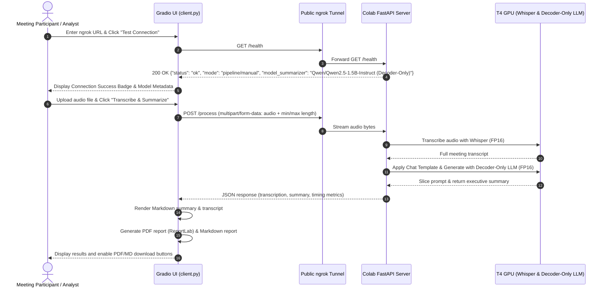

# 📘 Client Implementation Guide: `client.py`

This document provides a line-by-line and architectural walkthrough of [`client.py`](file:///mnt/d/Software%20Engineering/learning_llm_engineering/week_3/client.py). The client is a local desktop application built with [Gradio](https://www.gradio.app/) and [ReportLab](https://www.reportlab.com/) that connects to an accelerated Google Colab GPU backend hosting **Whisper (ASR)** and a **Decoder-Only Causal LLM (Qwen2.5-1.5B-Instruct)** over a secure [ngrok](https://ngrok.com/) tunnel.

---

## 🏗️ System Architecture & Workflow



---

## 🧩 Detailed Code Breakdown

### 1. Module Imports & Dependencies (Lines 1–25)

```python
import os
import io
import time
import tempfile
from typing import Tuple, Optional, Dict, Any
from datetime import datetime

import requests
import gradio as gr
from reportlab.lib.pagesizes import letter
from reportlab.lib.styles import getSampleStyleSheet, ParagraphStyle
from reportlab.platypus import SimpleDocTemplate, Paragraph, Spacer, Table, TableStyle, HRFlowable
from reportlab.lib import colors
```

- **`os`, `io`, `tempfile`**: Manage cross-platform temporary file paths when creating downloadable reports (`.pdf` and `.md`) and reading local audio files.
- **`time`, `datetime`**: Measure end-to-end client latency and generate ISO/human-readable timestamps for report headers.
- **`typing`**: Provides strict static type hints (`Tuple`, `Optional`, `Dict`, `Any`) across all function signatures for maintainability.
- **`requests`**: Handles HTTP/REST client communication with the remote FastAPI server over ngrok.
- **`gradio as gr`**: Powers the reactive web frontend with layout blocks, interactive inputs, audio recording widgets, and download handlers.
- **`reportlab.platypus`** & **`reportlab.lib`**: High-performance document generation engine. Platypus (*Page Layout and Typography Using Scripts*) uses a flowable architecture to assemble structured PDF documents without manual canvas coordinate calculations.

---

### 2. Global Configuration & Defaults (Lines 27–31)

```python
DEFAULT_BACKEND_URL: str = "http://localhost:8000"
REQUEST_TIMEOUT_SECONDS: int = 300  # 5 minutes for processing longer audio files
```

- **`DEFAULT_BACKEND_URL`**: Initial fallback URL. When developing locally or using port forwarding, requests hit port 8000. When connected to Colab, the user overrides this with their ngrok URL.
- **`REQUEST_TIMEOUT_SECONDS`**: Set to 300 seconds (5 minutes). Meeting audio recordings may range from 1 to 10+ minutes. Setting an aggressive timeout (such as the default 10s) would terminate the HTTP socket before Whisper and the Decoder-Only LLM finish processing.

---

### 3. Backend Health Verification (`check_backend_health`, Lines 33–73)

```python
def check_backend_health(backend_url: str) -> Tuple[str, str]:
```

This function performs a lightweight diagnostic check against the backend:

1. **URL Sanitization:**
   ```python
   clean_url = backend_url.strip().rstrip("/")
   ```
   Strips trailing slashes and extraneous whitespace, preventing malformed URLs like `https://xxxx.ngrok-free.app//health`.
2. **Ping the `/health` Endpoint:**
   Sends an HTTP GET request with a strict 10-second timeout:
   ```python
   response = requests.get(health_url, timeout=10)
   ```
3. **Parse Diagnostics:**
   When HTTP 200 is returned, it unpacks the server payload:
   - `mode`: Whether the backend is running `PIPELINE` or `MANUAL` inference.
   - `model_asr`: ASR identifier (`openai/whisper-small`).
   - `model_summarizer`: Summarizer identifier (`Qwen/Qwen2.5-1.5B-Instruct (Decoder-Only)`).
4. **Resilient Exception Handling:**
   Catches specific failure modes:
   - `requests.exceptions.Timeout`: Notifies the user that the server took longer than 10 seconds.
   - `requests.exceptions.ConnectionError`: Alerts the user if the ngrok tunnel is closed or incorrect.
   - General exceptions: Catches any other network or protocol issues without crashing the Gradio server.

---

### 4. Audio Processing & API Dispatch (`call_transcription_api`, Lines 75–210)

```python
def call_transcription_api(
    audio_path: Optional[str],
    backend_url: str,
    min_summary_length: int,
    max_summary_length: int,
    progress: gr.Progress = gr.Progress(track_tqdm=True),
) -> Tuple[str, str, str, Optional[str], Optional[str]]:
```

This is the core pipeline coordinator on the client side:

1. **Input Validation:**
   - Validates that an audio file was recorded or selected. If missing, raises `gr.Error("Please upload or record an audio file...")`, which displays an accessible toast alert in the Gradio UI.
   - Validates that the backend URL is populated.
2. **Multi-Part Form Data Assembly:**
   ```python
   with open(audio_path, "rb") as audio_file:
       files = {"file": (filename, audio_file, "audio/mpeg")}
       response = requests.post(
           endpoint_url,
           data=form_data,
           files=files,
           timeout=REQUEST_TIMEOUT_SECONDS,
       )
   ```
   The audio stream is sent as `multipart/form-data` alongside summary length parameters (`min_length`, `max_length`). This matches FastAPI's `UploadFile` and `Form` parameter signatures.
3. **Round-Trip Latency Measurement:**
   Records client elapsed time via `time.time() - start_time`, providing visibility into total network round-trip overhead compared to raw GPU inference time.
4. **Response Parsing & Metrics Dashboard:**
   Unpacks the JSON response:
   - `transcription`: Raw text output from Whisper.
   - `summary`: Abstractive summary from the Decoder-Only LLM.
   - `audio_duration_seconds`: Input audio length.
   - `metrics`: Dictionary detailing ASR duration, summarization duration, and Colab backend total processing time.
   Constructs a formatted Markdown table displaying word/character counts and timing telemetry.
5. **Report Generation:**
   Calls `create_pdf_report()` and `create_markdown_report()`, returning file paths that bind directly to Gradio's `gr.DownloadButton`.

---

### 5. PDF Generation Engine (`create_pdf_report`, Lines 213–345)

```python
def create_pdf_report(
    summary: str,
    transcription: str,
    audio_duration: float,
    client_time: float,
    backend_metrics: Dict[str, Any],
) -> str:
```

Uses ReportLab's document templating engine:

1. **File Destination:**
   Creates a uniquely timestamped filename in the system's temporary directory (`tempfile.gettempdir()`), preventing race conditions or filename collisions across runs:
   ```python
   timestamp_str = datetime.now().strftime("%Y%m%d_%H%M%S")
   pdf_filename = os.path.join(temp_dir, f"meeting_summary_{timestamp_str}.pdf")
   ```
2. **Typography & Styling:**
   Configures a clean visual hierarchy using `ParagraphStyle`:
   - `DocTitle`: 22pt bold, dark slate `#1e293b`.
   - `DocSubtitle`: 10pt muted slate `#64748b`.
   - `SectionHeader`: 14pt bold navy `#0f172a`.
   - `BodyTextCustom`: 10pt with 15pt leading for readability.
   - `TranscriptStyle`: 9pt oblique with compact leading for verbatim dialogue.
3. **Structured Flowables & Tables:**
   - Assembles a 4-column `Table` displaying audio duration, ASR execution time, summarization time, and total client latency with background shading (`#f8fafc`) and subtle borders (`#e2e8f0`).
   - Uses `HRFlowable` for visual section dividers.
   - Splits paragraphs by newline and wraps each in a `Paragraph` flowable to ensure automatic text wrapping and pagination.
4. **Compilation:**
   Calls `doc.build(story)`, outputting a print-ready vector PDF document.

---

### 6. Markdown Report Generation (`create_markdown_report`, Lines 348–405)

```python
def create_markdown_report(
    summary: str,
    transcription: str,
    audio_duration: float,
    client_time: float,
    backend_metrics: Dict[str, Any],
) -> str:
```

Creates an interoperable Markdown export formatted for knowledge-base indexing (Obsidian, Notion, GitHub):
- Includes **YAML Frontmatter** containing ISO timestamps and processing metadata.
- Employs GitHub-flavored markdown headings (`#`, `##`), horizontal rules, and block formatting.

---

### 7. Gradio UI Layout Construction (`build_interface`, Lines 417–533)

```python
def build_interface() -> gr.Blocks:
```

Constructs the UI using Gradio Blocks:

1. **Header & Connection Accordion:**
   - Textbox for entering the Colab ngrok URL.
   - "Test Connection" button triggering `check_backend_health`.
   - Dynamic Markdown status badge displaying connection state.
2. **Dual-Column Layout (`gr.Row`):**
   - **Left Column (40% width):** Audio upload/recording component (`gr.Audio`), expandable accordion with min/max summary token sliders, and a prominent "Transcribe & Summarize" trigger button.
   - **Right Column (60% width):**
     - Tab 1: **Executive Summary** (formatted Markdown).
     - Tab 2: **Full Transcription** (scrollable viewport constrained by `max_lines=18` with `autoscroll=False` and copy support via `buttons=['copy']`).
     - Tab 3: **Execution Telemetry** (latency breakdown table).
     - Export area: Two `gr.DownloadButton` widgets for downloading the generated `.pdf` and `.md` files.
3. **Event Bindings:**
   - Connects button clicks to Python functions using `test_conn_btn.click(...)` and `process_btn.click(...)`.
   - Connects return values directly to the output UI components.

---

### 8. Execution Entry Point (Lines 536–551)

```python
if __name__ == "__main__":
    demo_app = build_interface()
    theme = gr.themes.Soft(
        primary_hue="indigo",
        secondary_hue="blue",
        neutral_hue="slate",
    )
    # Launch locally on port 7860 (passing theme to launch() as required in Gradio 6.0+)
    demo_app.launch(
        theme=theme,
        server_name="0.0.0.0",
        server_port=7860,
        share=False,
    )
```

Launches the local web server on port `7860`, passing the theme to `launch()` as required by Gradio 6.0+. Accessible at `http://localhost:7860`.

---

## 🚀 How to Run the Client

1. Ensure dependencies are installed in your Python environment:
   ```bash
   uv run --project .. python client.py
   # or
   python client.py
   ```
2. Open your browser at `http://localhost:7860`.
3. Paste the ngrok URL generated by either `backend_pipeline.ipynb` or `backend_manual.ipynb`.
4. Upload an audio recording and click **🚀 Transcribe & Summarize**.
