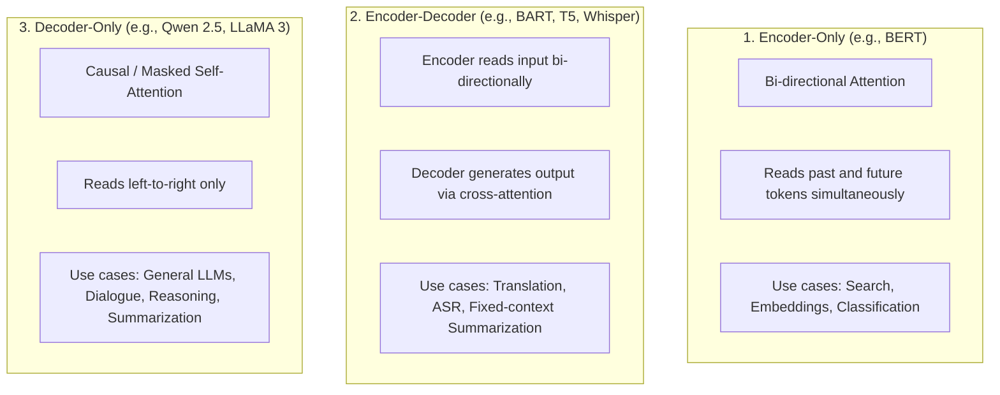
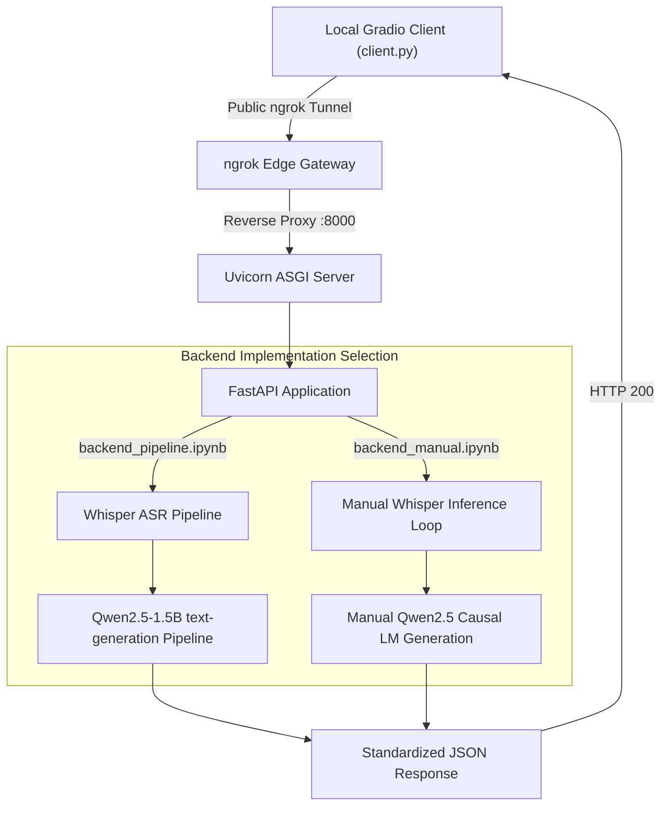

# 📓 Colab Backends Deep Dive: Pipeline vs. Strict Manual Inference (with Decoder-Only LLMs)


agy --conversation=596b76b2-05fa-4ed5-bb0a-bea70e25e44b
This document provides an exhaustive, line-by-line and theoretical walkthrough of both backend notebooks:
1. [`backend_pipeline.ipynb`](file:///mnt/d/Software%20Engineering/learning_llm_engineering/week_3/backend_pipeline.ipynb) (Hugging Face `pipeline` abstraction)
2. [`backend_manual.ipynb`](file:///mnt/d/Software%20Engineering/learning_llm_engineering/week_3/backend_manual.ipynb) (Strict manual PyTorch inference loops)

Both anotebooks run on a Google Colab **T4 GPU** (16 GB VRAM) and expose an **identical FastAPI HTTP interface** tunneled through [ngrok](https://ngrok.com/).

---

## 🧠 Part 1: Theoretical Foundations of Decoder-Only Models

### 1. What is a Decoder-Only Model?
A **Decoder-Only model** is an artificial intelligence architecture based on the Transformer that uses **only the autoregressive decoder stack** to process input and generate text.

Rather than having two separate networks—one encoder to read the input and one decoder to write the output—a decoder-only model treats everything (system prompt, conversation history, and model response) as a **single, flat sequence of tokens**, generating output one token at a time from left to right.

Prominent decoder-only models include **GPT-4, LLaMA 3, Mistral, and Qwen 2.5**.



### 2. The Core Mechanism: Causal (Masked) Self-Attention
In a decoder-only model, each token can only attend to **itself and prior tokens**, never to future tokens. This is enforced via a lower-triangular causal attention mask:

$$\text{Attention}(Q, K, V) = \text{softmax}\left(\frac{QK^T}{\sqrt{d_k}} + M\right)V$$

Where $M_{ij} = -\infty$ for $j > i$ (future positions). This objective trains the model on **Next-Token Prediction** (Causal Language Modeling):

$$P(w_1, w_2, \dots, w_T) = \prod_{t=1}^T P(w_t \mid w_1, \dots, w_{t-1})$$

---

### 3. Why Must We Use `tokenizer.apply_chat_template()` for Decoder-Only Models?

Because a decoder-only model perceives everything as a single continuous string of tokens, it does not inherently understand the concept of a "user message" or an "assistant reply."

To distinguish conversational roles, model creators fine-tune base models with **special delimiter tokens**:

| Model Family | Delimiter Formatting |
| :--- | :--- |
| **ChatML / Qwen** | `<|im_start|>system\n...<|im_end|>\n<|im_start|>user\n...<|im_end|>\n<|im_start|>assistant\n` |
| **LLaMA 3** | `<|start_header_id|>user<|end_header_id|>\n\n...<|eot_id|><|start_header_id|>assistant<|end_header_id|>\n\n` |
| **Mistral** | `<s>[INST] ... [/INST]` |

Remembering these proprietary delimiters is error-prone. Hugging Face tokenizers provide `apply_chat_template()`:

```python
messages = [
    {"role": "system", "content": "You are a meeting assistant."},
    {"role": "user", "content": "Summarize this meeting transcript: ..."}
]

# Applies the model's exact Jinja template:
prompt = tokenizer.apply_chat_template(
    messages,
    tokenize=False,
    add_generation_prompt=True  # Appends the assistant header!
)
```

#### The Role of `add_generation_prompt=True`
When `add_generation_prompt=True` is passed, the tokenizer appends the trailing delimiter that prompts the assistant to speak (for instance, `<|im_start|>assistant\n`). Without this flag, the prompt ends at the user's turn, causing the model to either hallucinate another user message or stop generating immediately.

---

### 4. The Critical Output Prompt Slicing Step

In an Encoder-Decoder model (such as BART), `model.generate()` returns **only the newly generated summary tokens**.

However, in a **Decoder-Only model**, `model.generate()` returns the **entire sequence: input prompt tokens PLUS newly generated response tokens**:

```text
output_ids = [ [prompt_token_1, prompt_token_2, ..., prompt_token_N,  summary_token_1, summary_token_2, ...] ]
               |---------------------- PROMPT ----------------------|  |------------- GENERATION ------------|
```

If you decode `output_ids[0]` directly without slicing, **the summary will contain the entire original meeting transcript inside it!**

Therefore, manual inference with decoder-only models **must slice off the prompt**:

```python
prompt_length = input_ids.shape[1]
generated_tokens = output_ids[0][prompt_length:]
summary = tokenizer.decode(generated_tokens, skip_special_tokens=True)
```

---

### 5. Why Does Decoder-Only Need `pad_token = eos_token`, While BART Did Not?

* **Encoder-Decoder (BART):** Pre-trained with a dedicated `<pad>` token (ID 1) with its own learned embedding vector. Overriding `pad_token = eos_token` on BART is destructive because it causes the beam search decoder to confuse padding with end-of-sentence stopping conditions.
* **Decoder-Only (Qwen, LLaMA):** Pre-trained on concatenated web text separated by `<eos>` without padding. By default, `tokenizer.pad_token` is often `None`. When passing tensors to `model.generate()`, PyTorch requires a valid `pad_token_id`. Thus, we explicitly set:
  ```python
  if summarizer_tokenizer.pad_token_id is None:
      summarizer_tokenizer.pad_token = summarizer_tokenizer.eos_token
      summarizer_tokenizer.pad_token_id = summarizer_tokenizer.eos_token_id
  ```

---

## 🏛️ System Architecture & Shared API Contract

Both backends expose an identical REST API, enabling [`client.py`](file:///mnt/d/Software%20Engineering/learning_llm_engineering/week_3/client.py) to connect seamlessly to either notebook.



### Shared API Endpoints

| Method | Endpoint | Request Payload | Response Schema |
| :--- | :--- | :--- | :--- |
| `GET` | `/health` | None | `{"status": "ok", "mode": "pipeline"\|"manual", "model_asr": "...", "model_summarizer": "...", "device": "..."}` |
| `POST` | `/process` | `multipart/form-data`<br>- `file`: Audio file (`UploadFile`)<br>- `min_length`: `int` (Form)<br>- `max_length`: `int` (Form) | `{"status": "success", "transcription": "...", "summary": "...", "audio_duration_seconds": float, "metrics": {"transcription_time_seconds": float, "summarization_time_seconds": float, "total_time_seconds": float}}` |

---

## 🚀 Notebook 1: `backend_pipeline.ipynb` (Pipeline Approach)

### Code Walkthrough by Cell

#### Cell 1: Package Installations
```bash
!pip install -q transformers accelerate soundfile librosa fastapi uvicorn pyngrok nest-asyncio python-multipart torch torchaudio
```
Installs core Hugging Face libraries, audio I/O decoders, ASGI web framework, and tunneling utilities.

#### Cell 2: Pipeline Initialization
```python
device = "cuda:0" if torch.cuda.is_available() else "cpu"
torch_dtype = torch.float16 if torch.cuda.is_available() else torch.float32

# 1. Whisper ASR Pipeline
asr_pipe = pipeline(
    task="automatic-speech-recognition",
    model="openai/whisper-small",
    chunk_length_s=30,
    stride_length_s=5,
    device=device,
    torch_dtype=torch_dtype,
    return_timestamps=False
)

# 2. Decoder-Only LLM Pipeline
llm_model_id = "Qwen/Qwen2.5-1.5B-Instruct"
summarizer_pipe = pipeline(
    task="text-generation",
    model=llm_model_id,
    device=device,
    torch_dtype=torch_dtype,
    model_kwargs={"low_cpu_mem_usage": True}
)
```
- **`automatic-speech-recognition`**: `openai/whisper-small` with `chunk_length_s=30` and `stride_length_s=5` to process arbitrarily long audio recordings without 30-second window cutoff errors.
- **`text-generation`**: `Qwen/Qwen2.5-1.5B-Instruct` loaded in `torch.float16` half-precision. Takes ~3 GB of VRAM, leaving ample room on Colab's 16 GB T4 GPU.

#### Cell 3: FastAPI Application & Pipeline Summarization Logic
```python
def summarize_with_decoder_pipeline(text: str, min_length: int = 30, max_length: int = 150) -> str:
    messages = [
        {"role": "system", "content": "You are an expert executive meeting assistant..."},
        {"role": "user", "content": f"Please summarize the following meeting transcription:\n\n{text}"}
    ]

    prompt = summarizer_pipe.tokenizer.apply_chat_template(
        messages,
        tokenize=False,
        add_generation_prompt=True
    )

    output = summarizer_pipe(
        prompt,
        max_new_tokens=max_length,
        min_new_tokens=min(min_length, max_length),
        do_sample=False,
        return_full_text=False,  # CRUCIAL: returns ONLY new response tokens
        pad_token_id=summarizer_pipe.tokenizer.pad_token_id or summarizer_pipe.tokenizer.eos_token_id
    )
    return output[0]["generated_text"].strip()
```
- **`return_full_text=False`**: Prevents the text-generation pipeline from prepending the original prompt to the generated output.
- **FastAPI Endpoints**:
  - `GET /health`: Returns service status and loaded model names.
  - `POST /process`: Reads uploaded audio, extracts duration with `librosa`, executes ASR and LLM summarization, measures execution latencies, and returns a JSON payload.

#### Cell 4: ngrok Tunnel & Uvicorn Launch
Opens a public tunnel via `pyngrok`, applies `nest_asyncio` to allow nested loops in Colab, and starts the Uvicorn server on port 8000.

---

## ⚙️ Notebook 2: `backend_manual.ipynb` (Strict Manual Inference)

### Code Walkthrough by Cell

#### Cell 2: Manual Component Instantiation
```python
from transformers import (
    AutoProcessor,
    AutoModelForSpeechSeq2Seq,
    AutoTokenizer,
    AutoModelForCausalLM,
)

# 1. Whisper ASR Components
asr_processor = AutoProcessor.from_pretrained("openai/whisper-small")
asr_model = AutoModelForSpeechSeq2Seq.from_pretrained(
    "openai/whisper-small",
    torch_dtype=torch_dtype,
    low_cpu_mem_usage=True,
).to(device)
asr_model.eval()

# 2. Decoder-Only LLM Components (AutoModelForCausalLM)
llm_model_id = "Qwen/Qwen2.5-1.5B-Instruct"
summarizer_tokenizer = AutoTokenizer.from_pretrained(llm_model_id)

if summarizer_tokenizer.pad_token_id is None:
    summarizer_tokenizer.pad_token = summarizer_tokenizer.eos_token
    summarizer_tokenizer.pad_token_id = summarizer_tokenizer.eos_token_id

summarizer_model = AutoModelForCausalLM.from_pretrained(
    llm_model_id,
    torch_dtype=torch_dtype,
    low_cpu_mem_usage=True,
).to(device)
summarizer_model.eval()
```
- **`AutoModelForCausalLM`**: Specifically instantiates a decoder-only architecture with a causal language modeling head (as opposed to `AutoModelForSeq2SeqLM` used for BART/T5).
- **`pad_token_id` Fallback**: Sets `pad_token = eos_token` so that tensor padding during generation does not trigger errors.

#### Cell 3: Manual Inference Loops from First Principles

##### 1. Manual ASR Loop (`manual_transcribe_audio`)
```python
def manual_transcribe_audio(audio_path: str) -> Tuple[str, float]:
    audio_array, sampling_rate = librosa.load(audio_path, sr=16000, mono=True)
    total_samples = len(audio_array)
    chunk_size = 16000 * 30  # 480,000 samples
    transcribed_segments: List[str] = []

    for start_idx in range(0, total_samples, chunk_size):
        end_idx = min(start_idx + chunk_size, total_samples)
        chunk = audio_array[start_idx:end_idx]

        if len(chunk) < 4000:
            continue

        # Step 1: Feature Extraction (waveform -> 80-channel log-Mel spectrogram)
        inputs = asr_processor(chunk, sampling_rate=16000, return_tensors="pt")
        input_features = inputs.input_features.to(device, dtype=torch_dtype)

        # Step 2: Autoregressive Sequence Generation
        with torch.no_grad():
            predicted_ids = asr_model.generate(
                input_features,
                max_new_tokens=448,
                num_beams=1,
                do_sample=False
            )

        # Step 3: Detokenization
        chunk_transcription = asr_processor.batch_decode(
            predicted_ids,
            skip_special_tokens=True
        )[0].strip()

        if chunk_transcription:
            transcribed_segments.append(chunk_transcription)

    return " ".join(transcribed_segments).strip(), audio_duration
```

##### 2. Manual Decoder-Only Summarization Loop (`manual_summarize_text`)
```python
def manual_summarize_text(text: str, min_length: int = 30, max_length: int = 150) -> str:
    messages = [
        {"role": "system", "content": "You are an expert executive meeting assistant..."},
        {"role": "user", "content": f"Please summarize the following meeting transcription:\n\n{text}"}
    ]

    # Step 1: Tokenize using the model's native chat template
    prompt_tokenized = summarizer_tokenizer.apply_chat_template(
        messages,
        tokenize=True,
        add_generation_prompt=True,
        return_tensors="pt"
    )

    if isinstance(prompt_tokenized, torch.Tensor):
        input_ids = prompt_tokenized.to(device)
        attention_mask = torch.ones_like(input_ids).to(device)
    else:
        input_ids = prompt_tokenized["input_ids"].to(device)
        attention_mask = prompt_tokenized["attention_mask"].to(device)

    prompt_length = input_ids.shape[1]

    # Step 2: Generate new tokens via Causal LM
    with torch.no_grad():
        output_ids = summarizer_model.generate(
            input_ids=input_ids,
            attention_mask=attention_mask,
            max_new_tokens=max_length,
            min_new_tokens=min(min_length, max_length),
            do_sample=False,
            pad_token_id=summarizer_tokenizer.pad_token_id,
            eos_token_id=summarizer_tokenizer.eos_token_id
        )

    # Step 3: CRITICAL DECODER-ONLY STEP - Slice off prompt tokens!
    generated_tokens = output_ids[0][prompt_length:]

    # Step 4: Decode generated tokens into clean text
    decoded_summary = summarizer_tokenizer.decode(
        generated_tokens,
        skip_special_tokens=True,
        clean_up_tokenization_spaces=True
    )
    return decoded_summary.strip()
```

---

## 📊 Comprehensive Comparison Matrix

| Dimension | Pipeline Approach (`backend_pipeline.ipynb`) | Strict Manual Inference (`backend_manual.ipynb`) |
| :--- | :--- | :--- |
| **Model Type** | Decoder-Only (`Qwen/Qwen2.5-1.5B-Instruct`) | Decoder-Only (`Qwen/Qwen2.5-1.5B-Instruct`) |
| **Class Used** | `pipeline("text-generation")` | `AutoTokenizer` + `AutoModelForCausalLM` |
| **Chat Templating** | `summarizer_pipe.tokenizer.apply_chat_template` | `summarizer_tokenizer.apply_chat_template` |
| **Prompt Truncation / Slicing** | Handled via `return_full_text=False` | Explicit tensor slicing: `output_ids[0][prompt_length:]` |
| **Pad Token Strategy** | Handled via pipeline keyword argument | Explicit check: `if pad_token_id is None: pad_token = eos_token` |
| **ASR Chunking** | Pipeline arguments (`chunk_length_s=30`) | Explicit 30-second array slicing loop |
| **Tensor Manipulation** | Hidden behind pipeline wrapper | Explicit tensors (`input_features`, `input_ids`, `attention_mask`) |
| **VRAM Footprint** | ~3.8 GB total (Whisper + Qwen in FP16) | ~3.8 GB total (Whisper + Qwen in FP16) |
| **Production Suitability** | Fast development, minimal boilerplate | Maximum observability, custom generation stopping criteria, fine-grained control |
