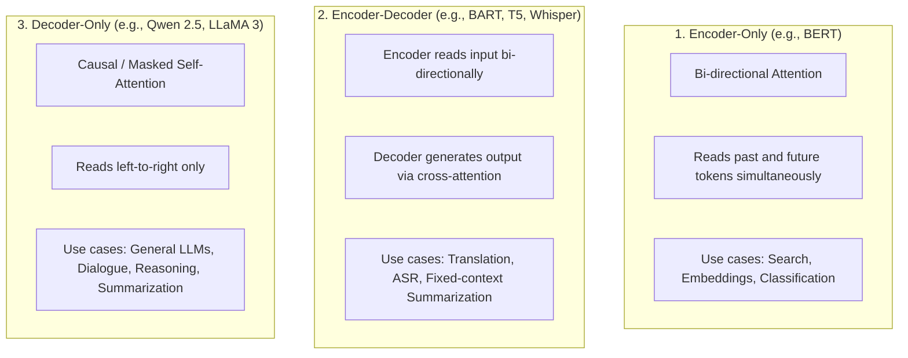
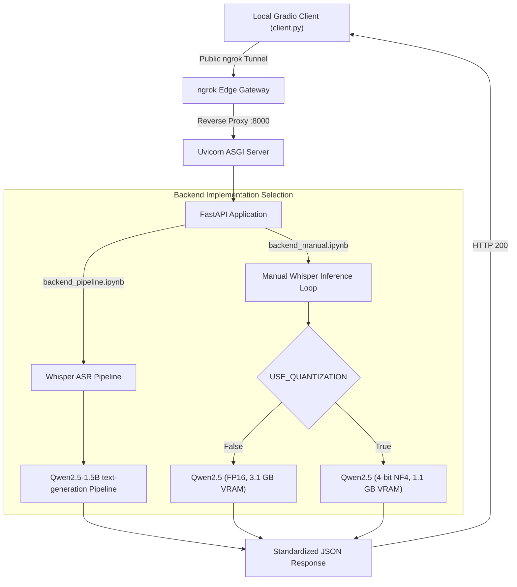

# 📓 Colab Backends Deep Dive: Pipeline vs. Strict Manual Inference (with Decoder-Only LLMs, Quantization & HF Auth)

This document provides an exhaustive, line-by-line and theoretical walkthrough of both backend notebooks:
1. [`backend_pipeline.ipynb`](file:///mnt/d/Software%20Engineering/learning_llm_engineering/week_3/backend_pipeline.ipynb) (Hugging Face `pipeline` abstraction)
2. [`backend_manual.ipynb`](file:///mnt/d/Software%20Engineering/learning_llm_engineering/week_3/backend_manual.ipynb) (Strict manual PyTorch inference loops with optional 4-bit quantization)

Both notebooks run on a Google Colab **T4 GPU** (16 GB VRAM) and expose an **identical FastAPI HTTP interface** tunneled through [ngrok](https://ngrok.com/).

---

## 🔑 Part 1: Hugging Face Authentication

### 1. Why Authenticate with Hugging Face?
By default, requests to the Hugging Face Model Hub are anonymous. Adding authentication provides two major benefits:
1. **Access Gated Models:** Popular state-of-the-art models (such as `meta-llama/Llama-3.2-3B-Instruct`, `google/gemma-2-2b-it`, or fine-tuned proprietary checkpoints) require accepting license agreements. Without a valid token, downloads fail with `401 Client Error: Repository Not Found or Access Denied`.
2. **Elevated Rate Limits:** High-frequency model downloads from Google Colab shared IP addresses can be throttled. Authenticated requests use higher per-user quotas.

### 2. Dual-Mode Token Loading in the Notebooks
Both notebooks implement a resilient dual-mode token loading pattern:

```python
from huggingface_hub import login

# 1. Check Google Colab Secrets (Native Key icon in left sidebar)
try:
    from google.colab import userdata
    HF_TOKEN = userdata.get('HF_TOKEN')
except Exception:
    HF_TOKEN = None

# 2. Fallback to manual token string
if not HF_TOKEN or HF_TOKEN == "YOUR_HF_TOKEN_HERE":
    HF_TOKEN = "YOUR_HF_TOKEN_HERE"  # <-- Paste token from https://huggingface.co/settings/tokens

if HF_TOKEN and HF_TOKEN != "YOUR_HF_TOKEN_HERE":
    login(token=HF_TOKEN)
    print("[✓] Successfully authenticated with Hugging Face Hub!")
    hf_auth = HF_TOKEN
else:
    print("[!] No Hugging Face token set. Proceeding with anonymous public access...")
    hf_auth = None
```

* **Method A (Colab Secrets - Recommended):** Click the **🔑 Secrets** icon on the left panel in Google Colab, add a secret named `HF_TOKEN`, paste your token, and toggle "Notebook access". Your token remains hidden from screenshots and shared notebook links.
* **Method B (Direct String):** Paste your token directly into `HF_TOKEN = "hf_..."` in Step 2.
* **Explicit Propagation:** The variable `token=hf_auth` is passed directly into `pipeline()` in `backend_pipeline.ipynb` and into `from_pretrained(..., token=hf_auth)` in `backend_manual.ipynb`.

---

## 🧠 Part 2: Theoretical Foundations of Decoder-Only Models

### 1. What is a Decoder-Only Model?
A **Decoder-Only model** is an artificial intelligence architecture based on the Transformer that uses **only the autoregressive decoder stack** to process input and generate text.

Rather than having two separate networks—one encoder to read the input and one decoder to write the output—a decoder-only model treats everything (system prompt, conversation history, and model response) as a **single, flat sequence of tokens**, generating output one token at a time from left to right.

Prominent decoder-only models include **GPT-4, LLaMA 3, Mistral, and Qwen 2.5**.



### 2. The Core Mechanism: Causal (Masked) Self-Attention
In a decoder-only model, each token can only attend to **itself and prior tokens**, never to future tokens. This is enforced via a lower-triangular causal attention mask:

$$\text{Attention}(Q, K, V) = \text{softmax}\left(\frac{QK^T}{\sqrt{d_k}} + M\right)V$$

Where $M_{ij} = -\infty$ for $j > i$ (future positions). This objective trains the model on **Next-Token Prediction** (Causal Language Modeling):

$$P(w_1, w_2, \dots, w_T) = \prod_{t=1}^T P(w_t \mid w_1, \dots, w_{t-1})$$

---

### 3. Why Must We Use `tokenizer.apply_chat_template()` for Decoder-Only Models?

Because a decoder-only model perceives everything as a single continuous string of tokens, it does not inherently understand the concept of a "user message" or an "assistant reply."

To distinguish conversational roles, model creators fine-tune base models with **special delimiter tokens**:

| Model Family | Delimiter Formatting |
| :--- | :--- |
| **ChatML / Qwen** | `<|im_start|>system\n...<|im_end|>\n<|im_start|>user\n...<|im_end|>\n<|im_start|>assistant\n` |
| **LLaMA 3** | `<|start_header_id|>user<|end_header_id|>\n\n...<|eot_id|><|start_header_id|>assistant<|end_header_id|>\n\n` |
| **Mistral** | `<s>[INST] ... [/INST]` |

Remembering these proprietary delimiters is error-prone. Hugging Face tokenizers provide `apply_chat_template()`:

```python
messages = [
    {"role": "system", "content": "You are a meeting assistant."},
    {"role": "user", "content": "Summarize this meeting transcript: ..."}
]

# Applies the model's exact Jinja template:
prompt = tokenizer.apply_chat_template(
    messages,
    tokenize=False,
    add_generation_prompt=True  # Appends the assistant header!
)
```

#### The Role of `add_generation_prompt=True`
When `add_generation_prompt=True` is passed, the tokenizer appends the trailing delimiter that prompts the assistant to speak (for instance, `<|im_start|>assistant\n`). Without this flag, the prompt ends at the user's turn, causing the model to either hallucinate another user message or stop generating immediately.

---

### 4. The Critical Output Prompt Slicing Step

In an Encoder-Decoder model (such as BART), `model.generate()` returns **only the newly generated summary tokens**.

However, in a **Decoder-Only model**, `model.generate()` returns the **entire sequence: input prompt tokens PLUS newly generated response tokens**:

```text
output_ids = [ [prompt_token_1, prompt_token_2, ..., prompt_token_N,  summary_token_1, summary_token_2, ...] ]
               |---------------------- PROMPT ----------------------|  |------------- GENERATION ------------|
```

If you decode `output_ids[0]` directly without slicing, **the summary will contain the entire original meeting transcript inside it!**

Therefore, manual inference with decoder-only models **must slice off the prompt**:

```python
prompt_length = input_ids.shape[1]
generated_tokens = output_ids[0][prompt_length:]
summary = tokenizer.decode(generated_tokens, skip_special_tokens=True)
```

---

### 5. Why Does Decoder-Only Need `pad_token = eos_token`, While BART Did Not?

* **Encoder-Decoder (BART):** Pre-trained with a dedicated `<pad>` token (ID 1) with its own learned embedding vector. Overriding `pad_token = eos_token` on BART is destructive because it causes the beam search decoder to confuse padding with end-of-sentence stopping conditions.
* **Decoder-Only (Qwen, LLaMA):** Pre-trained on concatenated web text separated by `<eos>` without padding. By default, `tokenizer.pad_token` is often `None`. When passing tensors to `model.generate()`, PyTorch requires a valid `pad_token_id`. Thus, we explicitly set:
  ```python
  if summarizer_tokenizer.pad_token_id is None:
      summarizer_tokenizer.pad_token = summarizer_tokenizer.eos_token
      summarizer_tokenizer.pad_token_id = summarizer_tokenizer.eos_token_id
  ```

---

## 🔬 Part 3: Quantization Theory & Implementation

### 1. What is Quantization?
**Quantization** maps high-precision numerical values (typically 16-bit or 32-bit floating point numbers) to lower-precision discrete representations (such as 8-bit integers or 4-bit floats).

$$\text{Quantized Value } q = \text{round}\left(\frac{x}{S}\right) + Z$$

Where:
* $x$ is the original high-precision weight.
* $S$ is the **Scale factor** ($S = \frac{\max(x) - \min(x)}{2^b - 1}$ for $b$ bits).
* $Z$ is the **Zero-point** (representing real value $0.0$).

### 2. Precision Comparison & Memory Footprint

| Precision | Bits | Bytes per Parameter | Model VRAM for 1.5B (Qwen) | Model VRAM for 7B | Model VRAM for 14B |
| :--- | :--- | :--- | :--- | :--- | :--- |
| **FP32 (Single)** | 32 | 4.0 bytes | ~6.2 GB | ~28.0 GB | ~56.0 GB |
| **FP16 / BF16 (Half)** | 16 | 2.0 bytes | ~3.1 GB | ~14.0 GB | ~28.0 GB (OOM on T4) |
| **INT8 (8-bit)** | 8 | 1.0 byte | ~1.6 GB | ~7.2 GB | ~14.4 GB |
| **4-bit (NF4)** | 4 | 0.5 bytes | **~1.1 GB** | **~4.5 GB** | **~9.2 GB (Fits on T4!)** |

**Memory Formula:**
$$\text{VRAM Footprint (GB)} \approx \frac{\text{Parameter Count} \times \text{Bits per Parameter}}{8 \times 10^9} + \text{KV-Cache Overhead}$$

### 3. Why Quantize? The Memory Bandwidth Bottleneck
During autoregressive LLM decoding, the GPU generates **one token at a time**.
For every single token generated, **the GPU must read all billions of model weights from High Bandwidth Memory (VRAM) into the Tensor Cores**.

Because LLM generation is **memory-bandwidth bound** (not compute-bound), cutting the weight size by 75% (from 16 bits to 4 bits) allows the GPU memory bus to stream the weights 2–3x faster, often resulting in **faster token generation** while slashing memory usage.

---

### 4. Anatomy of Modern 4-Bit NormalFloat (NF4) via `bitsandbytes`

Standard 4-bit integer quantization (`INT4`) assumes numbers are uniformly distributed across a range. However, deep neural network weights follow a **zero-mean Gaussian Normal Distribution** ($\mathcal{N}(0, \sigma^2)$).

Uniform quantizers waste discrete bins on extreme outliers where few weights exist. **NormalFloat 4 (NF4)**, introduced in the QLoRA paper (Dettmers et al., 2023), solves this:

1. **Information-Theoretic Equal Quantiles:** NF4 sets 16 discrete levels such that every bin has an **equal probability area** under the standard normal distribution curve. This retains $>99\%$ of FP16 accuracy.
2. **Double Quantization (DQ):** Quantizes the quantization constants (scales $S$) themselves from FP32 to 8-bit floats, saving an additional $0.37$ bits per parameter (~370 MB on a 7B model).
3. **16-Bit Compute Dtype:** Weights are **stored in 4 bits** in VRAM, but when a token activation arrives, the weights are dequantized on-the-fly to FP16 (`bnb_4bit_compute_dtype=torch.float16`) for matrix multiplication, preventing precision underflow.

---

### 5. Quantization Implementation in [`backend_manual.ipynb`](file:///mnt/d/Software%20Engineering/learning_llm_engineering/week_3/backend_manual.ipynb)

In `backend_manual.ipynb`, quantization is implemented as a clean toggle:

```python
# TOGGLE OPTION: Set to True for 4-bit NF4, or False for standard FP16
USE_QUANTIZATION = False

if USE_QUANTIZATION:
    from transformers import BitsAndBytesConfig
    quant_config = BitsAndBytesConfig(
        load_in_4bit=True,
        bnb_4bit_quant_type="nf4",              # NormalFloat4 distribution
        bnb_4bit_compute_dtype=torch.float16,   # Dequantize to FP16 during matrix operations
        bnb_4bit_use_double_quant=True          # Double quantization of scale factors
    )
    # Note: When using quantization_config, device_map="auto" is required (do NOT call .to(device))
    summarizer_model = AutoModelForCausalLM.from_pretrained(
        llm_model_id,
        quantization_config=quant_config,
        device_map="auto",                      # Automatically maps quantized layers onto GPU
        low_cpu_mem_usage=True,
        token=hf_auth
    )
else:
    # Standard FP16 loading:
    summarizer_model = AutoModelForCausalLM.from_pretrained(
        llm_model_id,
        torch_dtype=torch_dtype,
        low_cpu_mem_usage=True,
        token=hf_auth
    ).to(device)
```

#### ⚠️ Critical Hugging Face Gotcha: `device_map="auto"` vs `.to(device)`
* With standard models, you manually move weights to GPU using `.to(device)`.
* With `BitsAndBytesConfig`, calling `.to(device)` will throw a `ValueError: .to is not supported for 4-bit/8-bit models`. You **must** let `device_map="auto"` assign the tensors.
* In the inference loop, we safely retrieve the target device via `model_device = summarizer_model.device`, guaranteeing compatibility whether quantized or unquantized.

---

## 🏛️ System Architecture & Shared API Contract

Both backends expose an identical REST API, enabling [`client.py`](file:///mnt/d/Software%20Engineering/learning_llm_engineering/week_3/client.py) to connect seamlessly to either notebook.



### Shared API Endpoints

| Method | Endpoint | Request Payload | Response Schema |
| :--- | :--- | :--- | :--- |
| `GET` | `/health` | None | `{"status": "ok", "mode": "pipeline"\|"manual", "model_asr": "...", "model_summarizer": "...", "device": "..."}` |
| `POST` | `/process` | `multipart/form-data`<br>- `file`: Audio file (`UploadFile`)<br>- `min_length`: `int` (Form)<br>- `max_length`: `int` (Form) | `{"status": "success", "transcription": "...", "summary": "...", "audio_duration_seconds": float, "metrics": {"transcription_time_seconds": float, "summarization_time_seconds": float, "total_time_seconds": float}}` |

---

## 📊 Comprehensive Comparison Matrix

| Dimension | Pipeline Approach (`backend_pipeline.ipynb`) | Strict Manual Inference (`backend_manual.ipynb`) |
| :--- | :--- | :--- |
| **Model Type** | Decoder-Only (`Qwen/Qwen2.5-1.5B-Instruct`) | Decoder-Only (`Qwen/Qwen2.5-1.5B-Instruct`) |
| **Hugging Face Authentication** | `huggingface_hub.login(token=HF_TOKEN)` + `token=hf_auth` | `huggingface_hub.login(token=HF_TOKEN)` + `token=hf_auth` |
| **Quantization Support** | Standard FP16 (or custom model_kwargs) | **Built-in optional 4-bit NF4 via `BitsAndBytesConfig`** |
| **VRAM Footprint** | ~3.8 GB (Whisper + Qwen FP16) | **~1.8 GB (Whisper + Qwen 4-bit NF4)** or ~3.8 GB (FP16) |
| **Class Used** | `pipeline("text-generation")` | `AutoTokenizer` + `AutoModelForCausalLM` |
| **Chat Templating** | `summarizer_pipe.tokenizer.apply_chat_template` | `summarizer_tokenizer.apply_chat_template` |
| **Prompt Slicing** | Handled via `return_full_text=False` | Explicit tensor slice: `output_ids[0][prompt_length:]` |
| **Pad Token Fallback** | Handled via pipeline `pad_token_id` kwarg | Explicit `if pad_token_id is None: pad_token = eos_token` |
| **ASR Chunking** | Pipeline arguments (`chunk_length_s=30`) | Explicit 30-second array slicing loop |
| **Tensor Manipulation** | Hidden behind pipeline wrapper | Explicit tensors (`input_features`, `input_ids`, `attention_mask`) |
| **Device Mapping** | Direct device assignment (`device="cuda:0"`) | `device_map="auto"` (quantized) or `.to(device)` (standard) |
